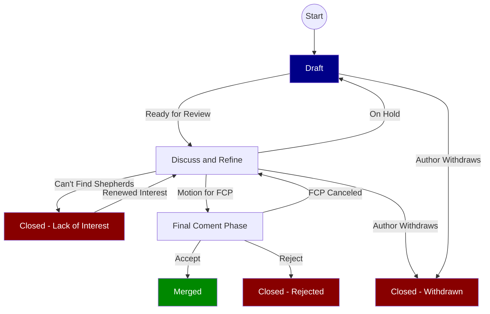

# Nix RFCs (Request For Comments)

Many changes, including bug fixes and documentation improvements can be
implemented and reviewed via the normal GitHub pull request workflow.

Some changes though are "substantial", and we ask that these be put through a
bit of a design process and produce a consensus among the Nix community.

## When this process is followed

This process is followed when one intends to make "substantial" changes to the
Nix ecosystem. What constitutes a "substantial" change is evolving based on
community norms, but may include the following.

* Any semantic or syntactic change to the language that is not a bug fix
* Removing language features
* Big restructuring of Nixpkgs
* Expansions to the scope of Nixpkgs (new arch, major subprojects, ...)
* Introduction of new interfaces or functions

Certain changes do not require an RFC:

* Adding, updating and removing packages in Nixpkgs
* Fixing security updates and bugs that don't break interfaces

Pull requests that contain any of the aforementioned 'substantial' changes may
be closed if there is no RFC connected to the proposed changes.

## Terminology

##### RFC Steering Committee
A team of people defined by [RFC 36](./rfcs/0036-rfc-process-team-amendment.md)
and stays consistent until the team members are changed via a follow-up RFC.
This committee is responsible for forming an RFC Shepherd team from the
available nominations on each RFC. This team also names the leader of the
Shepherd team. This has to happen within 1 week after the PR has been opened.
Until then the Steering Committee is responsible for guiding the discussion. In
case of the Shepherding Team not doing its work the Steering Committee shall
encourage them or step in and assign new Shepherds. They also are in charge of
merging accepted and rejected RFCs. Generally by these expectations they should
find time to meet once a week for about an hour.

They have no special responsibility with regard to the content of an RFC, they
can weigh in on them, the same as any other community member, but are only in
charge of:
 * selecting the Shepherds unanimously
 * supervising that the Shepherds are carrying out their work
 * committing the final RFC

##### Shepherd Team
A team of 3-4 community members defined unanimously by the RFC Steering
Committee, responsible for accepting or rejecting a specific RFC. This team is
created per RFC from community members nominated in the discussion on that RFC.

This team should be people who are very familiar with the main components
touched by the RFC. The author cannot be part of the Shepherd Team. In addition,
at most half of the Shepherd Team can be part of the RFC Steering Committee.

The responsibility of the team is to guide the discussion as long as it is
constructive, new points are brought up and the RFC is iterated on and from time
to time summarise the current state of discussion. If this is the case no longer,
then the Shepherd Team shall step in with a motion for FCP.

##### Shepherd Leader
The person in charge of the RFC process for a specific RFC, and responsible for
ensuring the process is followed in a timely fashion. The Shepherd Leader has no
special responsibility with regard to moving an undecided Shepherd Team to a
certain decision.

##### Final Comment Period (FCP)
A period of ten calendar days, which will be called by the Shepherd Team after
the RFC has received ample discussion and enough of the tradeoffs have been
discussed. The Shepherd Team will propose to either accept or reject the RFC
after the FCP.


## Process from Creation to Merge

*In short, to get a major change included in Nix or Nixpkgs, one must
first get the RFC merged into the RFC repository as a markdown file under the
`rfcs` directory. At that point the RFC is accepted and may be implemented
with the goal of eventual inclusion into Nix or Nixpkgs.*





0. Have a cool idea!
0. Fill in the RFC. Put care into the details: RFCs that do not present
   convincing motivation, demonstrate understanding of the impact of the design,
   or are disingenuous about the drawbacks or alternatives tend to be
   poorly-received. Consider using [Semantic Line Breaks](https://sembr.org/)
   in order to get better diffs on later amendments.
0. Consider publishing your RFC as pre-RFC [in the forum](https://discourse.nixos.org/c/dev/rfc-steering-committee/33)
   to gather initial feedback and iron out the remaining typos.
0. In case your RFC is a technical proposal, you might want to prepare a
   prototype of your idea to firstly make yourself aware of potential pitfalls
   and also help reviewers understand the RFC. Code may be able to explain some
   issues in short.
0. Submit a pull request. As a pull request the RFC will receive design feedback
   from the larger community, and the author should be prepared to revise it in
   response.
0. For the nomination process for potential members of the RFC Shepherd Team,
   that is specific to each RFC, anyone interested can either nominate another
   person or themselves to be a potential member of the RFC Shepherd Team. This
   can already be done when submitting the PR.
0. The RFC Steering Committee assigns a subset of the nominees to the RFC
   Shepherd Team and designates a leader for it. This has to be done
   unanimously.
0. Build consensus and integrate feedback. RFCs that have broad support are much
   more likely to make progress than those that don't receive any comments. Feel
   free to reach out to the RFC Shepherd Team leader in particular to get help
   identifying stakeholders and obstacles.
0. The RFC Shepherd Team will discuss the RFC pull request, as much as possible
   in the comment thread of the pull request itself. Discussion outside of the
   pull request, either offline or in a video conference, that might be
   preferable to get to a solution for complex issues, will be summarized on the
   pull request comment thread.
0. RFCs rarely go through this process unchanged, especially as alternatives and
   drawbacks are shown. You can make edits, big and small, to the RFC to clarify
   or change the design, but make changes as new commits to the pull request,
   and leave a comment on the pull request explaining your changes.
   Specifically, do not squash or rebase commits after they are visible on the
   pull request.
0. At some point, a member of the RFC Shepherd Team will propose to start the
   "Final Comment Period" (FCP) on behalf of the team, along with a disposition
   for the RFC (usually "merge" or "close").
    * This step is taken when enough of the tradeoffs have been discussed that
      the RFC Shepherd Team is in a position to make a decision. That does not
      require consensus amongst all participants in the RFC thread (which is
      usually impossible). However, the argument supporting the disposition on
      the RFC needs to have already been clearly articulated, and there should
      not be a strong consensus against that position outside of the RFC
      Shepherd Team. RFC Shepherd Team members use their best judgment in taking
      this step, and the FCP itself ensures there is ample time and notification
      for stakeholders to push back if it is made prematurely.
    * For RFCs with lengthy discussion, the motion to FCP is usually preceded by
      a summary comment trying to lay out the current state of the discussion
      and major tradeoffs/points of disagreement.
    * In order to actually enter FCP, it must be made clear that all members of
      the RFC Shepherd Team sign off the motion, e.g. through comments, reactions,
      approving reviews or a meeting protocol.
0. The FCP is advertised widely by the shepherds, most importantly in the relevant
   [Discourse announcements category](https://discourse.nixos.org/c/announcements/rfc-announcements/22).
   It lasts ten calendar days starting with the Discourse announcement, so that
   it is open for at least 5 business days. This way all stakeholders have a
   chance to lodge any final objections before a decision is reached.
0. In most cases, the FCP is quiet, and the RFC is either merged or
   closed. However, sometimes substantial new arguments or ideas are raised,
   the FCP is canceled, and the RFC goes back into development mode.
   The feedback during FCP may result in minor adjustments to the RFC, this is
   not necessarily a reason to cancel FCP.
0. In case of acceptance, the RFC Steering Committee merges the PR.
   Otherwise the RFC's pull request is closed. If no
   consensus can be reached on the RFC but the idea in general is accepted, it
   gets closed, too. A note is added that is should be proposed again, when the
   circumstances, that are stopping the discussion to come to another decision,
   change.

### Unhappy Cases

Ideally every RFC will complete review and be accepted or rejected. Unfortunately this can not always be the case. Much like in distributed systems, timeouts are needed to avoid spending resources monitoring tasks that will never complete.

#### On Hold

If the author is unable or unwilling to update the RFC in a timely fashion they may mark an RFC as "On Hold" to indicate that the RFC should not continue to be pushed forward for the time being.

The author can [mark the PR as a Draft](https://docs.github.com/en/pull-requests/collaborating-with-pull-requests/proposing-changes-to-your-work-with-pull-requests/changing-the-stage-of-a-pull-request#converting-a-pull-request-to-a-draft) and the existing label [status: on hold](https://github.com/NixOS/rfcs/pulls?q=is%3Apr+label%3A%22status%3A+on+hold%22+is%3Aopen) can be applied to the PR by the NixOS RFC Steering Committee for tracking reasons.

RFCs in Draft status will be completely ignored by the NixOS RFC Steering Committee. It is also expected that community members will largely refrain from review until the author has indicated that the RFC is once again ready.

At any point of time the author can either remove the Draft status from the RFC to indicate that they believe that it is ready for additional review and that they have the time to continue the RFC process. Or they can close the RFC to indicate that this RFC is unlikely to to ever move forward.

## Can't Find Shepherds

If an RFC is unable to find an adequate number of shepherds after 1 month of being open, the following message will be added to the PR to suggest ways to find more support:

```markdown
RFCSC:

This RFC has not acquired enough shepherds. This typically shows lack of interest from the community. In order to progress [a full shepherd team is required](https://github.com/NixOS/rfcs/#shepherd-team). Consider trying to raise interest by [posting in Discourse](https://discourse.nixos.org/), [talking in Matrix](https://matrix.to/#/#community:nixos.org) or reaching out to people that you know.

If not enough shepherds can be found in the next month we will close this RFC until we can find enough interested participants. The PR can be reopened at any time if more shepherd nominations are made.

[See more info on the Nix RFC process here](https://github.com/NixOS/rfcs/blob/master/README.md)
```

If another month elapses after and a shepherd team still hasn't been assembled the following message will be posted, the `status: insufficient interest` label will be added and the issue will be closed.

```markdown
RFCSC: This RFC is being closed due to lack interest. If enough shepherds are found this issue can be reopened. If you don't have permission to reopen please [open an issue for the NixOS RFC Steering Committee](https://github.com/NixOS/rfc-steering-committee/issues/new) linking to this PR.
```

## The RFC life-cycle

Most RFCs describe changes that eventually need to be implemented, usually in
form of pull requests against one of the Nix\* repositories. Ideally,
implementations are ready to be merged alongside the RFC when it gets accepted.
Other times, implementation happens only after the RFC gets accepted.
Being accepted is not a rubber stamp,
and in particular still does not mean the feature will ultimately be merged; it
does mean that in principle all the major stakeholders have agreed to the
feature and are amenable to merging it. In general though this means that the
implementation will be merged as long as there are no substantial technical
objections to the implementation.

Furthermore, the fact that a given RFC has been accepted implies nothing about
what priority is assigned to its implementation, nor does it imply anything
about whether a Nix/Nixpkgs developer has been assigned the task of implementing
the feature. While it is not necessary that the author of the RFC also write the
implementation, it is by far the most effective way to see an RFC through to
completion: authors should not expect that other project developers will take on
responsibility for implementing their accepted feature.

RFC documents are intended to be seen as the documentation of a decision and a
snapshot of a moment in time, rather than a specification-like normative document.
Think more of a Matrix Spec Proposal and less like an IETF RFC. Therefore,
once accepted, RFCs should generally not be substantially changed. Only very
minor changes should be submitted as amendments (via a follow-up pull request).
It is the general expectation that any information intended to be normative and
"outlive" the initial RFC process should live outside of the RFC document, mostly
in documentation and code. These may be subject to change as usual, and of course
any "substantial" changes will again require a new RFC. Usually there is no need
to update the original RFC to keep it up with updates on the implementation.

## Members of the RFC Steering Committee

The current members of the RFC Steering Committee can be seen on the [NixOS website](https://nixos.org/community/teams/rfc-steering-committee).


## License

All contributions are licensed by their respective authors under the
[CC-BY-SA 4.0 License](https://creativecommons.org/licenses/by-sa/4.0/legalcode).
