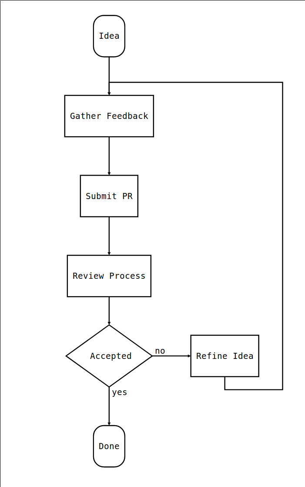
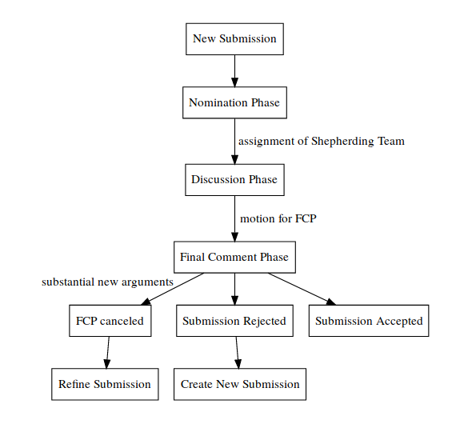

# Nix RFCs (Request For Comments)

Many ideas, including bug fixes and documentation improvements can be
implemented and reviewed via the normal GitHub pull request workflow.

Some ideas though are "substantial", and we ask that these be put through a
bit of a public process and produce a consensus among the Nix community.

## When this process is followed

This process is followed when one intends to make "substantial" changes to the
Nix ecosystem. What constitutes a "substantial" change is evolving based on
community norms, but may include the following.

* Any semantic or syntactic change to the language that is not a bug fix
* Removing language features
* Big restructuring of Nixpkgs
* Expansions to the scope of Nixpkgs (new arch, major subprojects, ...)
* Introduction of new interfaces or functions
* Making changes to important of formalised community processes
* Record important proof-generated insights that affect the whole community
* Propose an important experiment that affects the whole community
* Document important design issues that affect the whole community
* Start a talk/account/etc. that "officially represents the nix community"

Certain changes do not require an RFC:

* Adding, updating and removing packages in Nixpkgs
* Fixing security updates and bugs that don't break interfaces

Pull requests that contain any of the aforementioned 'substantial' ideas may
be closed if there is no RFC connected to the proposed changes.

## Terminology

##### RFC Steering Committee
A team of people defined by [RFC 36](./rfcs/0036-rfc-process-team-amendment.md)
and stays consistent until the team members are changed via a follow-up RFC.
This committee is responsible for forming an RFC Shepherd team from the
available nominations on each RFC. This team also names the leader of the
Shepherd team. This has to happen within 1 week after the PR has been opened.
Until then the Steering Committee is responsible for guiding the discussion. In
case of the Shepherding Team not doing its work the Steering Committee shall
encourage them or step in and assign new Shepherds. They also are in charge of
merging accepted and rejected RFCs. Generally by these expectations they should
find time to meet once a week for about an hour.

They have no special responsibility with regard to the content of an RFC, they
can weigh in on them, the same as any other community member, but are only in
charge of:
 * selecting the Shepherds unanimously
 * supervising that the Shepherds are carrying out their work
 * committing the final RFC

##### Shepherd Team
A team of 3-4 community members defined unanimously by the RFC Steering
Committee, responsible for accepting or rejecting a specific RFC. This team is
created per RFC from community members nominated in the discussion on that RFC.

This team should be people who are very familiar with the main components
touched by the RFC. The author cannot be part of the Shepherd Team. In addition,
at most half of the Shepherd Team can be part of the RFC Steering Committee.

The responsibility of the team is to guide the discussion as long as it is
constructive, new points are brought up and the RFC is iterated on and from time
to time summarise the current state of discussion. If this is the case no longer,
then the Shepherd Team shall step in with a motion for FCP.

##### Shepherd Leader
The person in charge of the RFC process for a specific RFC, and responsible for
ensuring the process is followed in a timely fashion. The Shepherd Leader has no
special responsibility with regard to moving an undecided Shepherd Team to a
certain decision.

##### Final Comment Period (FCP)
A period of ten calendar days, which will be called by the Shepherd Team after
the RFC has received ample discussion and enough of the tradeoffs have been
discussed. The Shepherd Team will propose to either accept or reject the RFC
after the FCP.

##### RFC Categories
In order to do do justice to the different aspects of documents that merit
generation of broad community consensus via the RFC process, we classify each
RFC as _feature_, _process_ or _informational_. All follow the same
high-level process as described above, but each category requires a different
"mode of discussion", templates, criteria and judgment that it is beneficial
to the overall RFC process to identify those categories explicitly.

## Process from Creation to Merge

*In short, to get a major change included in Nix, Nixpkgs or the ecosystem, one must
first get the RFC merged into the RFC repository as a markdown file under the
`rfcs` directory. At that point the RFC is accepted and may be implemented
with the goal of eventual inclusion into Nix, Nixpkgs or the Ecosystem.

0. Have a cool idea or an important information!
1. Identify its category: _feature_, _process_ or _informational_.
2. Start with the correct template and follow the instructions and comments.
3. Submit a pull request. As a pull request the RFC will receive design feedback
   from the larger community, and the author should be prepared to revise it in
   response.
4. For the nomination process for potential members of the RFC Shepherd Team,
   that is specific to each RFC, anyone interested can either nominate another
   person or themselves to be a potential member of the RFC Shepherd Team. This
   can already be done when submitting the PR.
5. The RFC Steering Committee assigns a subset of the nominees to the RFC
   Shepherd Team and designates a leader for it. This has to be done
   unanimously.
6. Build consensus and integrate feedback. RFCs that have broad support are much
   more likely to make progress than those that don't receive any comments. Feel
   free to reach out to the RFC Shepherd Team leader in particular to get help
   identifying stakeholders and obstacles.
7. The RFC Shepherd Team will discuss the RFC pull request, as much as possible
   in the comment thread of the pull request itself. Discussion outside of the
   pull request, either offline or in a video conference, that might be
   preferable to get to a solution for complex issues, will be summarized on the
   pull request comment thread.
8. RFCs rarely go through this process unchanged, especially as alternatives and
   drawbacks are shown. You can make edits, big and small, to the RFC to clarify
   or change the design, but make changes as new commits to the pull request,
   and leave a comment on the pull request explaining your changes.
   Specifically, do not squash or rebase commits after they are visible on the
   pull request.
9. At some point, a member of the RFC Shepherd Team will propose a "motion for
   final comment period" (FCP), along with a disposition for the RFC (merge or
   close).
    * This step is taken when enough of the tradeoffs have been discussed that
      the RFC Shepherd Team is in a position to make a decision. That does not
      require consensus amongst all participants in the RFC thread (which is
      usually impossible). However, the argument supporting the disposition on
      the RFC needs to have already been clearly articulated, and there should
      not be a strong consensus against that position outside of the RFC
      Shepherd Team. RFC Shepherd Team members use their best judgment in taking
      this step, and the FCP itself ensures there is ample time and notification
      for stakeholders to push back if it is made prematurely.
    * For RFCs with lengthy discussion, the motion to FCP is usually preceded by
      a summary comment trying to lay out the current state of the discussion
      and major tradeoffs/points of disagreement.
    * Before actually entering FCP, all members of the RFC Shepherd Team must
      sign off the motion.
10. The FCP lasts ten calendar days, so that it is open for at least 5 business
    days. It is also advertised widely, e.g. in NixOS Weekly and through
    Discourse announcements. This way all stakeholders have a chance to lodge
    any final objections before a decision is reached.
11. In most cases, the FCP period is quiet, and the RFC is either merged or
    closed. However, sometimes substantial new arguments or ideas are raised,
    the FCP is canceled, and the RFC goes back into development mode.
12. In case of acceptance, the RFC Steering Committee merges the PR.
    Otherwise the RFC's pull request is closed. If no
    consensus can be reached on the RFC but the idea in general is accepted, it
    gets closed, too. A note is added that is should be proposed again, when the
    circumstances, that are stopping the discussion to come to another decision,
    change.

## The RFC life-cycle

Once an RFC is accepted the authors may implement it and submit the feature as a
pull request to the Nix or Nixpkgs repo. Being accepted is not a rubber stamp,
and in particular still does not mean the feature will ultimately be merged; it
does mean that in principle all the major stakeholders have agreed to the
feature and are amenable to merging it. In general though this means that the
implementation will be merged as long as there are no substantial technical
objections to the implementation.

Furthermore, the fact that a given RFC has been accepted implies nothing about
what priority is assigned to its implementation, nor does it imply anything
about whether a Nix/Nixpkgs community member has been assigned the task of
implementing the RFC. While it is not necessary that the author of the RFC also
does the implementation, it is by far the most effective way to see an RFC through to
completion: authors should not expect that other project developers will take on
responsibility for implementing their accepted feature.

Minor modifications to accepted RFCs can be done in follow-up pull requests. We
strive to write each RFC in a manner that it will reflect the final state of
the world; but the nature of the process means that we cannot expect every
merged RFC to actually reflect what the end result will be after implementation.

In general, once accepted, RFCs should not be substantially changed. Only very
minor changes should be submitted as amendments. More substantial changes should
be new RFCs, with a note added to the original RFC. Exactly what counts as a
"very minor change" is up to the RFC Shepherd Team of the RFC to be amended, to
be decided in cooperation with the RFC Steering Committee.

## Members of the RFC Steering Committee

The current members of the RFC Steering Committee can be seen at the [NixOS/rfc-steering-committee](https://github.com/NixOS/rfc-steering-committee#workflow-for-rfc-steering-committee) repository.

## License

All contributions are licensed by their respective authors under the
[CC-BY-SA 4.0 License](https://creativecommons.org/licenses/by-sa/4.0/legalcode).
