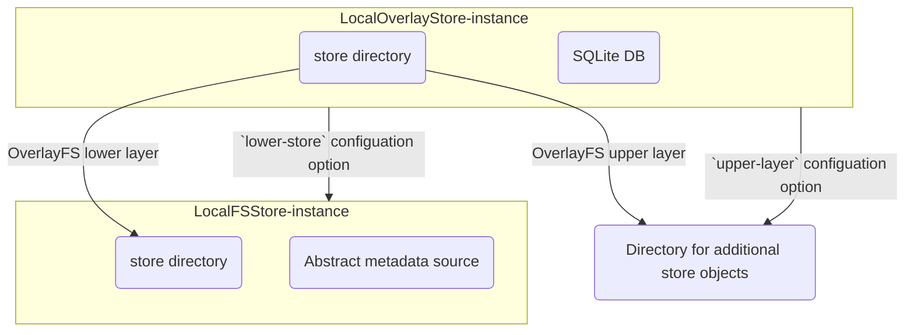
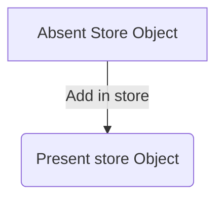
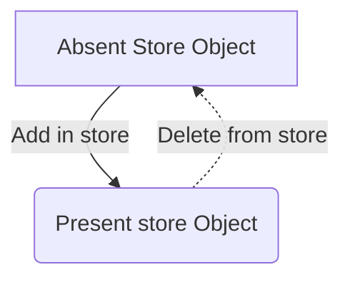
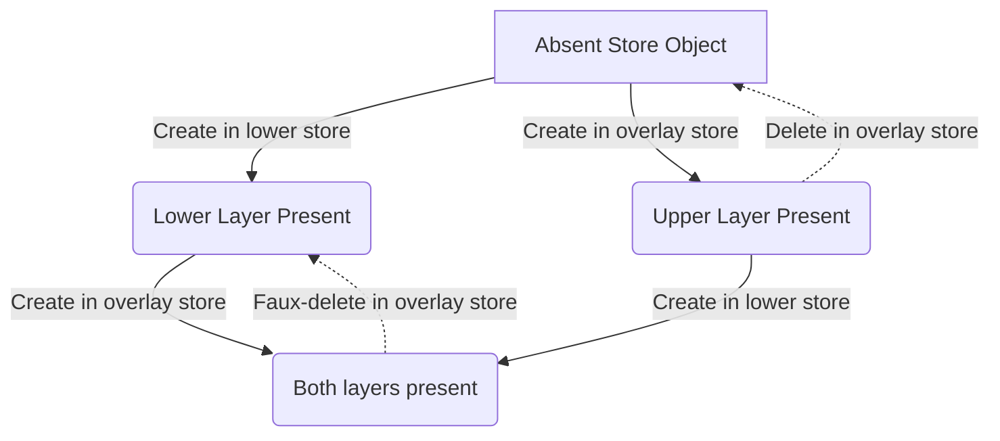
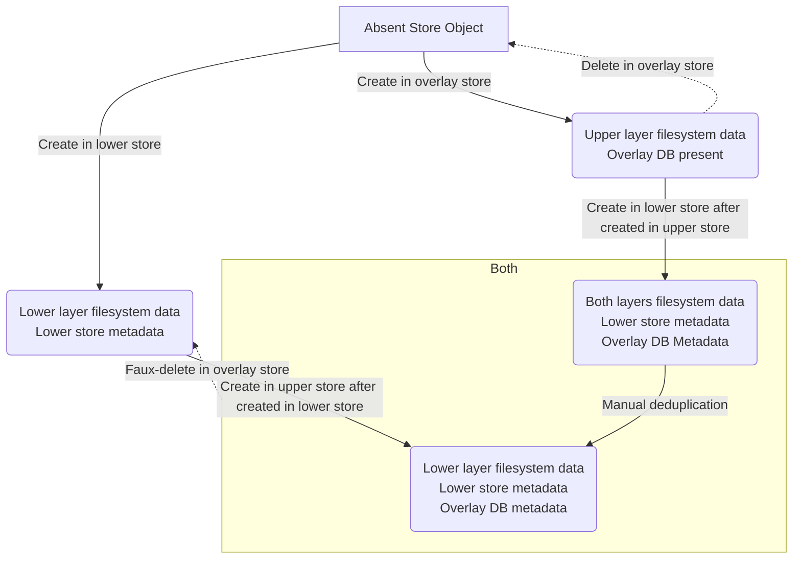

# Summary
[summary]: #summary

Add a new `local-overlay` store implementation to Nix.
This will be a local store that is layered upon another local filesystem store (local store or daemon).
This allows locally extending a shared store that is periodically updated with additional store objects.

# Motivation
[motivation]: #motivation

## Technical motivation

Many organizational users of Nix have a large collection of Nix store objects they wish to share with a number of consumers, be they human users, build farm workers etc.
The existing ways of doing this are:

- Share nothing: Copy store objects to each consumer

- Share everything: Use single mutable NFS store, carefully synchronizing updates.

- Overlay everything: Mount all of `/nix` (store and DB) with OverlayFS.

Each has serious drawbacks:

- "Share nothing" wastes tons of space as many duplicate store objects are stored separately.

- "Share everything" incurs major overhead from synchronization, even if consumers are making store objects they don't intend any other consumer to use.
  It also poses an inflexible security model where the actions of one consumer effect all of them.

- Overlay everything cannot take advantage of new store objects added to the lower store, because its "fork" of the DB covers up the lower store's.
  (Furthermore, separate files from the DB proper like an out of date SQLite Write-Ahead-Logging (WAL) file *could* leak through, causing chaos.)

The new `local-overlay` store also uses OverlayFS, but just for the store directory.
The database is still a regular fresh empty one to start, and instead Nix explicitly knows about the lower store, so it can get any information for the DB it needs from it manually.
This avoids all 3 downsides:

- Store objects are never duplicated by the overlay store.
  OverlayFS ensures that one copy in either layer is enough, and we are careful never to wastefully include a store object in the upper layer if it is already in the lower layer.

- No excess synchronization.
  Local changes are just that: local, not shared with any other consumer.
  The lower store is never written to (no modifications or even filesystem locks) so we should not encounter any slow write and sync paths in filesystem implementations like NFS.

- No rigidity of the lower store.
  Since Nix sees both the `overlay-store`'s DB and the lower store, it is possible for it to be aware of and utilize objects that were added to the lower store after the upper store was created.

This gives us a "best of all three worlds" solution.

## Marketing motivation

It is quite common for organizations using Nix to first adopt it behind the scenes.
That is to say, Nix is used to prepare some artifacts which are then presented to a consumer that need not be aware they were made with Nix.
Later though, because of Nix's gaining popularity, there may be a desire to reveal its usage so consumers can use Nix themselves.
Rather than Nix being a controversial tool worth hiding, it can be a popular tool worth exposing.
Nix-unaware usage can still work, but Nix-aware usage can do additional things.

The `local-overlay` store can serve as a crucial tool to bridge these two modes of using Nix.
The lower store can be served as before
--- however the artifacts were disseminated in the "hidden Nix" first phase of adoption
--- perhaps with only a small tweak to expose the DB / daemon socket if it wasn't before.
The `local-overlay` store is new, but purely local, separate for each user that wants to use Nix, and completely not impacting any user that doesn't.

By providing the `local-overlay` store, we are essentially completing a reusable step-by-step guide for Nix users to "Nixify their workplace" in a very conscientious and non-disruptive manner.

## Motivation in action

See [Replit's own announcement](https://blog.replit.com/super-colliding-nix-stores) of this feature (in its current non-upstreamed) form aimed at its users.
This covers many of the same points above, but for the perspective of Replit users that would like to use Nix rather than the Nix community.

# Detailed design
[design]: #detailed-design

## Basic principle

`local-overlay` is a store representing the extension of a lower store with a collection of additional store objects.
(We don't refer to the upper layer as an "upper store" because it is not self-contained
--- it doesn't abide by the closure property because objects in the upper layer can refer to objects that are only in the lower layer.)

## Class hierarchy, configuration settings, and initialization



`LocalOverlayStore` is a subclass of `LocalStore` implementing the `local-overlay` store.
It has additional configuration items for:

 - `lower-store`: The lower store, which must be a `LocalFSStore`

   This is specified with an escaped URL just like the `remote-store` setting of the two SSH stores types.

 - `upper-layer`: The directory used as the upper layer of the OverlayFS

 - `check-mount`: Whether to check the filesystem mount configuration

   Here is an example of how the nix.conf configuration might look:
   ```
   store = local-overlay?lower-store=/mnt/lower/%3Fread-only%3Dtrue&upper-layer=/mnt/scratch/nix/upper/store
   ```

With `check-mount` enabled, on initialization it checks that an OverlayFS mount exists matching these parameters:

 - The lower layer must be the lower store's "real store directory"

 - The upper layer must be the directory specified for this purpose

The database for the `local-overlay` store is exactly like that for a regular local store:

 - Same schema, including foreign key constraints

 - Created empty on opening the store if it doesn't exist

 - Opened existing one otherwise

## Data structure

These are diagrams for the possible states of a single store object.
Except for the closure property mandating that present store objects must have all their references also be present, store objects are independent.
We can therefore to a large extent get away with considering only a single store object.

### Graph Key

All the graphs below follow these conventions:

#### Nodes

- Right angle corners: Absent store object
- Rounded corners: Present store object

#### Edges

- Solid edge: "adding" or "deduplicating" direction
- Dotted edge: "deleting" direction

The graph when reduced to just one type of edge is always acyclic, and thus represents a partial order.

### Lower Store

While in use as a lower store by one or more overlay stores, a store most only grow "monotonically".
That is to say, the only way it is allowed to change is by extended it with additional store objects.



### Overlay Store logical view

The overlay store by contrast allows regular arbitrary options, almost.



The exception is objects that are part of the lower store.
They cannot be logically deleted, but are always part of the overlay store.

### Both stores simplified view

We can take the [Cartesian product](https://en.wikipedia.org/wiki/Cartesian_product_of_graphs) of these two graphs,
and additionally tweak it to cover the exception from above:



In particular, "Faux-delete" refers to the exception.
While the upper layer can "forget" about the store object, since the lower layer still contains it, the overlay store does also.
In particular, any of the 3 "present" nodes mean the store object is logically present.

### Both Store accurate physical view

The above graph doesn't cover duplication vs deduplication in the "both" state.
It also doesn't distinguish between stores directories and metadata.
Let's now make a more complex graph which covers both of these things:



Whenever the filesystem part of a store object reside in a layer, the metadata must also reside in that layer.
I.e. a lower layer of store dir store object must have lower store metadata (exact mechanism is abstract and unspecified, could be SQlite DB or daemon), and an upper layer of store object must have an overlay DB entry.
However, when we just have the store object in the lower layer, we may also have metadata in the upper layer.
That means there are two cases when the metadata is in both layers: the duplicated case (both layers filesystem) and deduplicated case (just lower layer filesystem).

## Operation

As discussed in the motivation, store objects are never knowingly duplicated.
The `local-overlay` store while in operation ensures that store objects are stored exactly once:
either in the lower store or the upper layer directory.
No file system data should ever be duplicated by `local-overlay` itself.

Non-filesystem data, what goes in the DB (references, signatures, etc.) is duplicated.
Any store object from the lower store that the `local-overlay` needs has that information copied into the `local-overlay` store's DB.
This includes information for the closure of any such store object, because the normal closure property enforced by the DB's foreign key constraints is upheld.

Store objects can still end up duplicated if the lower store later gains a store object the upper store already had.
This is because when the `local-overlay` is remounted, it doesn't know how the lower store may have changed, and when the lower store is added to, any upper store directories / DBs are not in general visible either.
We can have a "fsck" operation however that manually scans for missing / duplicated objects.

## Read-only `local` Store

*This was [already approved](https://github.com/NixOS/nix/pull/8356#event-9483342493) by the Nix team on an experimental basis, as an experimental feature that is trivial enough to be approved with out requiring an RFC.
It is still included here just to provide context.*

In order to facilitate using `local-overlay` where the lower store is entirely read only (read only SQLite files too, not just store directory), it is useful to also implement a new "read-only" setting on the `local` store.
The main thing this does is use SQLite's [immutable mode](https://www.sqlite.org/c3ref/open.html).

This is a separate feature;
it is perfectly possible to implement the `local-overlay` without this or vice-versa.
But for maximum usability, we want to do both.

# Examples and Interactions
[examples-and-interactions]: #examples-and-interactions

Because the `local-overlay` store is a completely separate store implementation, the interactions with the rest of Nix are fairly minimal and well-defined.
In particular, users of other stores and not the `local-overlay` store will not be impacted at all.

# Drawbacks
[drawbacks]: #drawbacks

## Read-only local store is delicate

SQLite's immutuable mode doesn't mean "we promise not to change the database".
It relies on the database not just being *logically* immutable (the meaning doesn't change), but *physically* immutable (no bytes of the on-disk files change).
This is because it is forgoing synchronization altogether and thus relying that nothing can be rearranged e.g. in the middle of a query (invalidating in-progress traversals of data structures, etc.).
This means there is no hope of, say "append only" mode where "publishers" only add new store objects to a local store, while read-only mode "subscribers" are able to deal with other store objects just fine.

This is an inconvenience for rolling out new versions of the lower store, but not a show stopper.
One solution is "multi version concurrency control" where consumers get an immutable snapshot of the lower store for the duration of each login.
New snapshots can only be gotten when consumers log in again, and old snapshots can only be retired once every consumer viewing them logs out.

## `local-overlay` lacks normal form for the database

A slight drawback with the architecture is a lack of a normal form.
A store object in the lower store may or may not have a DB entry in the `overlay-local` store.
This is the two "both" nodes in the last diagram.

This introduces some flexibility in the system: the same "logical" layered store can be represented in multiple different "physical" configurations.
This isn't a problem *per se*, but does mean there is a bit more complexity to consider during testing and system administration.

## Deleting isn't intuitive

For "deleting" lower store objects in the `local-overlay` store,
we don't actually remove them but just remove the upper DB entry.
This is somewhat surprising, but reflects the fact that the lower store is logically immutable (even when it isn't a `local` store opened in read-only mode).
By deleting the upper DB entry, we are not removing the object from the `local-overlay` store, but we are still resetting it to the initial state.

# Alternatives
[alternatives]: #alternatives

## Stock Nix with OverlayFS ("overlay everything" from motivation)

It is possible to use OverlayFS on the entire Nix store with stock Nix.
Just as added store objects would appear in the upper layer, so would the SQLite DB after any modification.

There are a few problems with this:

1. Once the lower store is "forked" in this way, there is no "merge".
   The modified DB in the upper layer will completely cover up the lower store's DB.
   If any new store objects are added to the lower store, the overlayFS-combined local store will never know.

2. The database can be very large.
   For example, Replit's 16 TB store has a 634 MB database.
   OverlayFS doesn't know how to duplicate only part of a SQLite database, so we have to duplicate the whole thing per user/consumer.
   This will waste lots of space with information the consumer may not care about.
   And for a many-user product like Replit's, that will be wasting precious disk quota from the user's perspective too.

## Use `nix-store --load-db` with the above

As suggested [on discourse](https://discourse.nixos.org/t/super-colliding-nix-stores/28462/7), it is possible to augment the DB with additional paths after it has been created.
Indeed, this is how the ISO installer for NixOS works.
Running this periodically can allow the consumer to pick up any new paths added to the lower store since the last run.

This does solve the first problem, but with poor performance penalty.
We don't know what paths have changed, so we have slurp up the entire DB.
With Replit's 16 TB store's DB, this took 10 minutes.

We could out of band try to track "revisions" so just new paths are added, but then we are adding a new source of complexity vs the "statelessness" of on-demand accessing the lower store (and relying on monotonicity).

## Bind mounts instead of overlayfs for `local-overlay` Store

Instead of mounting the entire lower store dir underneath ours via OverlayFS, we could bind mount individual store objects as we need them.
The bind-mounting store would not longer be the union of the lower store with the additional store objects, instead the lower store acts more as a special optimized substituter.

This gives a normal form in that objects are bind-mounted if and only if they have a DB entry in the bind-mounting store;
There is no "have store object, don't yet have DB entry" middle state to worry about.

The downside of this is that Nix needs elevate permissions in order to create those bind mounts, and the impact of having arbitrarily many bind mounts is unknown.
Even if this design works fine once set up, the imposition of an O(n) initialization setting up each bind mount is prohibitive for many use-cases.

## Store implementations using FUSE

We could have a single FUSE mount that could manually implement the "bind on demand" semantics described above without cluttering the mount namespace with an entry per each shared store object.
FUSE however is quite primitive, in that every read need to be shuffled via the FUSE server.
There is nothing like a "control plane vs data plane" separation where Nix could tell the OS "this directory is that other directory", and the OS can do the rest without involving the FUSE server.
That means the performance of FUSE are potentially worse than these in-kernel mounting solutions.

Also, this would require a good deal more code than the other solutions.
Perhaps this is a good thing; the status quo of Nix having to keep the OS and DB in sync is not as elegant as Nix squarely being the "source of truth", providing both filesystem and non-filesystem data about each store object directly.
But it represents as significantly greater departure from the status quo.

# Unresolved questions
[unresolved]: #unresolved-questions

None at this time.

# Future work
[future]: #future-work

## Alternative to read-only local store

We are considering a hybrid between the `local` store and `file://` store.
This would *not* use NARs, but would use "NAR info" files instead of a SQLite database.
This would side-step the concurrency issues of SQLite's read-only mode, and make "append only" usage of the store not require much synchronization.
(This is because the internal structure of the filesystem, unlike the internal structure of SQLite, is not visible to clients.)

It is true that this is much slower used directly --- that is why Nix switched to using SQLite in the first place --- but in combination with a `local-overlay` store this doesn't matter.
Since non-filesystem data is copied into the `local-overlay` store's DB, it will effectively act as a cache, speeding up future queries.
Each NAR info file only needs to be read once.

## "Pivoting" between lower store

Suppose a lower store wants to garbage collect some paths that overlay stores use.
As written above, this is illegal.
But if there was a "migration period" where the overlay stores could know what store objects were going to go away, they could copy them to the upper layer.

A way to implement that by exposed both the old and new versions of the lower store.
(This is simply enough to do with file systems that expose snapshots; it is out of scope for Nix itself).
Nix would them look at both the old and new lower stores, compute the diff, and then copy things over.

This goes well with the "fsck" operation, which also needs to check the entire upper layer for dangling references.
