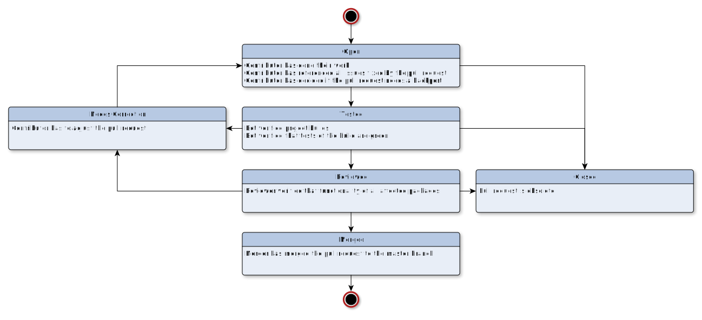

# Summary
[summary]: #summary

Pull-Request on GitHub are the main way we improve our code base.
This Document should settle everything that needs to be done
to bring code upstream in the
[Nixpkgs Repository](https://github.com/nixos/nixpkgs/).

# Motivation
[motivation]: #motivation

Eliminate questions from contributors and maintainers
about what should be done next and who should do it.
This is not a new approach, it is more a settlement
on how we do it now.

# Detailed design
[design]: #detailed-design

Define all steps of a Pull-Request.
Use Roles to define responsibilities in every step.

Terms like **SHOULD** and **MUST** are defined in 
[IETF RFC 2119](https://tools.ietf.org/html/rfc2119).

## Roles
[roles]: #roles

Everybody involved in the process of contributing has one or multiple
of the following roles

* `Contributor` is the person proposing the Pull-Request
* `Bot` is a bot that provides automated feedback
* `Reviewer` is any person that reviews the Pull-Request
  (for example a member of [NixOS/nixpkgs-maintainers](https://github.com/orgs/NixOS/teams/nixpkgs-maintainers))
* `Merger` is any person with merge privileges

The responsibilities of theses roles are defined in the rest of this RFC.

## States of a Pull-Request
[state]:#states

This diagram defines all states of a Pull-Request,
and their transitions to other states.

## Responsibilities and Actions
[responsibilities]:#responsibilities

The responsibilities of every role is defined by the following diagram:

## About Pull-Request

### Packages

* contributors **SHOULD** evaluate and signal that a Backport is necessary.
* the [NixOS/backports team](https://github.com/orgs/NixOS/teams/backports)
  **SHOULD** be pinged in situations that are unclear.
* the [NixOS/backports team](https://github.com/orgs/NixOS/teams/backports)
  **MUST** be informed about every Backport.
* after the Pull-Request to `master`, `staging` or `staging-next` is merged,
  the Backport Pull-Request is created
* Backport Pull-Requests **MUST** be linked to the original Pull-Requests (using `git cherry-pick -x`).
* [NixOS/nixpkgs-maintainers](https://github.com/orgs/NixOS/teams/nixpkgs-maintainers)
  and 
  [NixOS/backports](https://github.com/orgs/NixOS/teams/backports)
  can deny the backport.

### Modules

* modules **SHOULD** have tests
* reviewers **SHOULD** encourage contributors to write tests for new modules
* modules **SHOULD NOT** be Backported

## Links

* [How to write Module Tests](https://nixos.org/nixos/manual/index.html#sec-nixos-tests)
* [Contribution Guidelines](https://github.com/NixOS/nixpkgs/blob/master/.github/CONTRIBUTING.md)

# Unresolved questions
[unresolved]: #unresolved-questions

* The Pull-Request of a Backport should be created by the bot.
  But if that is the case, the original contributor might not be able
  to make changes on the branch behind the Pull-Request.
* Backports without changes in `master` are not discussed.
  for example security patches that only affect older versions in stable.

# Future work
[future]: #future-work

* The Pull-Request template needs an option "Backport needed?"
* Add a link to this document in the 
  [Contribution Guidelines](https://github.com/NixOS/nixpkgs/blob/master/.github/CONTRIBUTING.md)
