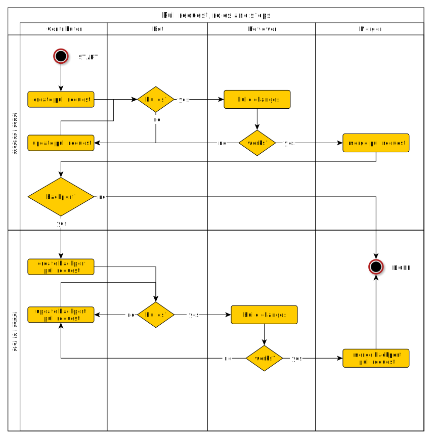

# Summary
[summary]: #summary

Pull request on GitHub are the main way we improve our code base.
This document should settle everything that needs to be done
to bring code upstream in the
[Nixpkgs Repository](https://github.com/nixos/nixpkgs/).

# Motivation
[motivation]: #motivation

Eliminate questions from contributors and maintainers
about what should be done next and who should do it.
This is not a new approach, it is more a settlement
on how we do it now.

# Detailed design
[design]: #detailed-design

Define all steps of a pull request.
Use Roles to define responsibilities in every step.

Terms like **SHOULD** and **MUST** are defined in 
[IETF RFC 2119](https://tools.ietf.org/html/rfc2119).

## Roles
[roles]: #roles

Everybody involved in the process of contributing has one or multiple
of the following roles

* *Contributor* is the person proposing the pull request
* *Bot* is a bot that provides automated feedback
* *Reviewer* is any person that reviews the pull request
  (for example a member of [NixOS/nixpkgs-maintainers](https://github.com/orgs/NixOS/teams/nixpkgs-maintainers))
* *Merger* is any person with merge privileges

The responsibilities of theses roles are defined in the rest of this RFC.

## States of a pull request
[state]:#states

This diagram defines all states of a pull request,
and their transitions to other states.

## Responsibilities and Actions
[responsibilities]:#responsibilities

The responsibilities of every role is defined by the following diagram:

## About pull requests

### Packages

* Contributors **SHOULD** evaluate and signal that a backport is necessary.
* The [NixOS/backports team](https://github.com/orgs/NixOS/teams/backports)
  **SHOULD** be pinged in situations that are unclear.
* The [NixOS/backports team](https://github.com/orgs/NixOS/teams/backports)
  **MUST** be informed about every backport.
* After the pull request to `master`, `staging` or `staging-next` is merged,
  the backport pull request is created
* Backport pull requests **MUST** be linked to the original pull requests (using `git cherry-pick -x`).
* [NixOS/nixpkgs-maintainers](https://github.com/orgs/NixOS/teams/nixpkgs-maintainers)
  and 
  [NixOS/backports](https://github.com/orgs/NixOS/teams/backports)
  can deny the backport.

### Modules

* Modules **SHOULD** have tests
* Reviewers **SHOULD** encourage contributors to write tests for new modules
* Modules **SHOULD NOT** be backported

## Links

* [How to write Module Tests](https://nixos.org/nixos/manual/index.html#sec-nixos-tests)
* [Contribution Guidelines](https://github.com/NixOS/nixpkgs/blob/master/.github/CONTRIBUTING.md)
* [What to Backport](https://gist.github.com/grahamc/c60578c6e6928043d29a427361634df6#what-to-backport)
* [RFC26 : Staging Workflow](./0026-staging-workflow.md)

# Unresolved questions
[unresolved]: #unresolved-questions

* The pull request of a backport should be created by the bot.
  But if that is the case, the original contributor might not be able
  to make changes on the branch behind the pull request.
* Backports without changes in `master` are not discussed.
  for example security patches that only affect older versions in stable.

# Future work
[future]: #future-work

* The pull request template needs an option "backport needed?"
* Add a link to this document in the 
  [Contribution Guidelines](https://github.com/NixOS/nixpkgs/blob/master/.github/CONTRIBUTING.md)
