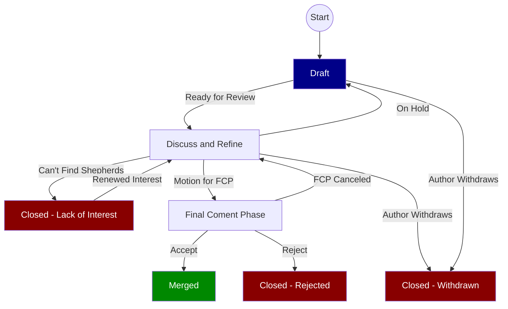

# Summary
[summary]: #summary

This defines two alternate "end states" for RFCs.

The "Awaiting Author" state defines an RFC that isn't ready to be pushed forward and is intentionally stalled. The NixOS RFC Steering Committee will not ping or push this RFC until it returns to the main workflow. These RFCs will be put into a draft status until they are ready to re-enter the process.

The "Lacking Interest" state defines an RFC that can not gather a shepherd team. This is taken to indicate that there is not enough interest in the Nix community. These RFCs will be Closed until more interest is gathered.

# Motivation
[motivation]: #motivation

The NixOS RFC process describes a process with a focus on moving RFCs toward completion. This is where an engaged author and community push an RFC to a decision, either to accept or reject the proposal.

However things don't always work like this. Sometimes the author doesn't have sufficent time or motivation to keep iterating on the RFC and sometimes the community doesn't have enuogh interested members to staff a shepherd team.

It is important that these "alternate exits" are well defined to avoid wasting effort trying to push a stalled RFC forward and to set clear expectations for all participants.

TL;DR timeouts are critical in distributed systems.

# Detailed design
[design]: #detailed-design

Here is an updated diagram for the RFC process.

There are 3 new transitions in this diagram.

## On Hold

This is for cases where the author is unable or unwilling to update the RFC in a timely fashon and would like to indicate that the RFC should not continue to be pushed forward for the time being.

The author can [mark the PR as a Draft](https://docs.github.com/en/pull-requests/collaborating-with-pull-requests/proposing-changes-to-your-work-with-pull-requests/changing-the-stage-of-a-pull-request#converting-a-pull-request-to-a-draft) and the existing label [status: on hold](https://github.com/NixOS/rfcs/pulls?q=is%3Apr+label%3A%22status%3A+on+hold%22+is%3Aclosed) can be applied to the PR by the NixOS RFC Steering Committee for tracking reasons.

RFCs in this status will be completely ignored by the NixOS RFC Steering Committee. It is also expected that community members will largely refrain from review until the author has indicated that the RFC is again ready for review.

## Can't Find Shepherds

If an RFC is unable to find adaqite number of shepherds in 2 months it will be considered "low interest". The RFC will be closed to indicate that there is no expection of continuous forward progress.

After 1 month of being open the following message will be added to the PR to suggest ways to find more support:

> This RFC has not acquired enough shepherds. This typically shows lack of interest from the community. In order to progress [a full shepherd team is required](https://github.com/NixOS/rfcs/#shepherd-team). Consider trying to raise interest by [posting in Discourse](https://discourse.nixos.org/), [taking in Matrix](https://matrix.to/#/#community:nixos.org) or reaching out to people that you know.
>
> If not enough shepherds can be found in the next month we will close this RFC until we can find enough interested participants. The PR can be reopened at any time if more shepherd nominations are made.
>
> [See more info on the Nix RFC process here](https://github.com/NixOS/rfcs/blob/master/README.md)

If another month has elapsed since the warning without sufficent accepted nominations the following message will be posted, the `status: insufficent interest` label will be added and the issue will be closed.

> This RFC is being closed due to lack interest. If enough shepherds are found this issue can be reopened. If you don't have permission to reopen please [open an issue for the NixOS RFC Steering Committee](https://github.com/NixOS/rfc-steering-committee/issues/new) linking to this PR.

## Renewed Interest

If an RFC that was closed due to lack of interest finds sufficent interest it can be reopened and the `status: insufficent interest` label removed. The RFC will then continue through the RFC process as normal.

# Examples and Interactions
[examples-and-interactions]: #examples-and-interactions

## More Research Required

If an RFC is opened and discussion reveals that more research is required the author may now return their RFC to draft status to indicate that they are working on an update.

This is already done frequently done today but this RFC codifies this process. The alternative which is sometimes seen is that the NixOS RFC Steering Committee keeps pinging the RFC for months trying to move the RFC forward which is annoying and unproductive.

## Can't Find Shepherds

If an RFC is opened but a team of shepherds can't be assembed the RFC will now be closed.

Currently there is no process here and the NixOS RFC Steering Committee is unsure what to do and tends to annoyingly ping these RFCs with no positive outcome for a few months then improvise. This RFC proposes a well-defined process to ensure that everyone understands the process.

# Drawbacks
[drawbacks]: #drawbacks

## Closing a PR may be demotivating.

Strugging to find shepherds for an RFC may already be demotivating and having the RFC closed can be an aditional flag that the RFC is strugging. This may be demoralizing to the RFC author.

This issue is mitigated by having clear and well-thought-out messages to make it clear what is occuring at this stage of the process. This is hopefully better overall than the previously poorly defined state of forever waiting for more shepherds to appear.

## Closing a PR may reduce visibility for the RFC.

Leaving PRs open may increase the chance that a potential shepherd finds the RFC. Closing RFCs that can't find shepherds may worsen the thing that ails them.

It is the author's opinion that having dozens of open RFCs will also reduce visibility from the ones that do have more interest and are more likely to find a full shepherd team. Therefore this is considered acceptable cost. The addition of the `status: insufficent interest` label may also help to bring attention to these RFCs that could benifit from would-be shepherds.

# Alternatives
[alternatives]: #alternatives

## Do Nothing

Doing nothing leaves the behaviour to be taken when an RFC can not find a shepherd team undefined. This leads to inconsistent handling by the NixOS RFC Steering Committee and leaves community members unable to understand what to expect.

## Leave the PR open and add a label

This can reduce the burden from the NixOS RFC Steering Committee however it still clutters the list of "Open" RFCs with these RFCs that are not seeing forward progress. Ultimately it is a decision of definition of what "Open" means and this RFC takes the stance that if an RFC is stalled for too long it makes sense to remove it from the default search for "Open" RFCs.

# Unresolved questions
[unresolved]: #unresolved-questions

None

# Future work
[future]: #future-work

The ony work that needs to be done is updating documentation and informing the NixOS RFC Steering Committee.
