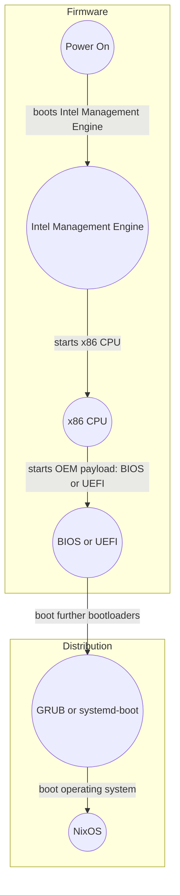
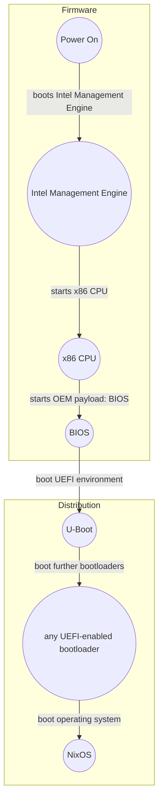
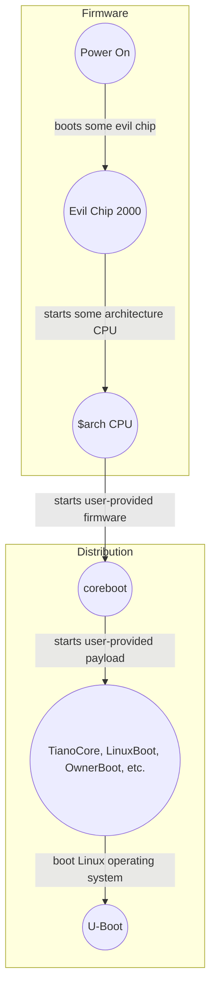

# Summary
[summary]: #summary

NixOS will have first-class support for UEFI
and uses it as a default boot environment, for supported architectures,
even in situations where only BIOS Boot Specification's legacy boot is available,
via a dual-stage payload consisting of a polyfill bootloader/firmware and a standard
UEFI bootloader.

To achieve this, it will downgrade the GRUB privileged position
in the project and offer it as a "best effort" basis alternative bootloader.

# Motivation
[motivation]: #motivation

Legacy boot is defined by the BIOS Boot specification, written in 1996: https://www.scs.stanford.edu/nyu/04fa/lab/specsbbs101.pdf.
Nowadays, computers are defaulting to UEFI more and more for the extended features provided (e.g. SecureBoot, native network boot, etc.).

Nevertheless, many legacy boots machines or machines that does not have support for UEFI are used with NixOS: Single Board Computers for example
on other architectures.

Let's put aside non-legacy boot payloads such as [Linuxboot](https://www.linuxboot.org/), [Ownerboot](https://sr.ht/~amjoseph/ownerboot/) and any similar payloads,
those are not legacy and they definitely have their places in the project, though, at the time of writing, no such payload is offered in NixOS.

In nixpkgs, legacy boot forces a dichotomy between `boot.loader.efi` and... at least two legacy bootloaders **in tree**: GRUB and a family of UBoot/extlinux-compatible/etc.

In the case of GRUB, there are increasing problems with this bootloader:

- Upstream do not do releases anymore: https://github.com/NixOS/nixpkgs/blob/nixos-unstable/pkgs/tools/misc/grub/default.nix#L62-L350
- Co-maintenance / release work with other ecosystems such as the kernel is simply not done: https://github.com/NixOS/nixpkgs/blob/nixos-unstable/pkgs/tools/misc/grub/default.nix#L345-L349 causing GRUB's drivers to explode in production for our users: https://github.com/NixOS/nixpkgs/pull/235222
- Our own maintenance of GRUB is subpar: https://github.com/NixOS/nixpkgs/pull/227741 https://github.com/NixOS/nixpkgs/pull/226821 https://github.com/NixOS/nixpkgs/pull/195805 https://github.com/NixOS/nixpkgs/pull/95901 https://github.com/NixOS/nixpkgs/pull/236027
- GRUB installation procedure uses `install-grub.pl`, one of the remaining Perl script: https://github.com/NixOS/nixpkgs/pull/95901#issuecomment-756702696 offered to rewrite it with sponsoring, but no one took the offer yet, it is also very complicated to integrate with it: https://github.com/nix-community/lanzaboote/pull/96
- GRUB installation procedure for UEFI-only is still confusing because our scripts does not handle well UEFI-only (you have to pass `nodev` and this is not very well documented). See https://github.com/NixOS/nixpkgs/issues/222491

The worse about this, is this is our **default** bootloader for our install images **because** of legacy boot.

In the case of UBoot/extlinux-compatible/etc. : we should definitely keep it, polish it and improve it for a better support of embedded systems, e.g. merging the differences
between Raspberry Pi's bootloader and extlinux-compatible's ones.

Getting rid of legacy boot opens up the way to get rid of GRUB as a default and offering an UEFI environment opens up the way to:

- having a default ISO booting systemd-boot which is a maintained (by systemd) bootloader with active releases, smaller code footprint, maintained also by Systemd team in Nixpkgs
- Features like https://github.com/NixOS/nixpkgs/pull/84204 could also be enabled for legacy boot users
- Users who wants to use GRUB drivers to mount non-standard ESP can make use of https://efi.akeo.ie/ which is compatible with any UEFI bootloader
- Boot testing can split into 2 ways: legacy boot compatibility layer tests and UEFI boot tests
- Successful adoption gives a positive signal to others distribution to consider it, provide development resources to improve it rather than being held by the existing things, etc.

# Detailed design
[design]: #detailed-design

Currently, most x86 computers^[For a more complete reference, read: https://safeboot.dev/chain-of-trust/] boot in a similar way to this **on a very high level** :

In other platforms, you can see extra payloads like <https://github.com/ARM-software/arm-trusted-firmware> or <https://github.com/riscv-software-src/opensbi>
before the distribution part, sometimes, it can be part of the distribution if control can be exerted.

Some machines does even have control on the OEM payload or a good subset of the firmware, for example, via <https://www.coreboot.org/> or
<https://github.com/oreboot/oreboot>.

The idea is to transform this flowchart into:

and keep it the old way whenever the OEM payload is UEFI already.

If we take a step back, we can notice this 2-stage payload boot story can be generalized in those situations:

In this situation, (c)oreboot could be a replacement of U-Boot environment and any UEFI-enabled bootloader could be replaced by any payload.

Therefore, the design has to be general enough to support both usecases.

Removing legacy boot will use a deprecation schedule and proceed into multiple steps. This RFC is dependent on accepted minimal implementations, where 'minimal' has to
be defined in this RFC.

# Examples and Interactions
[examples-and-interactions]: #examples-and-interactions

Fedora is considering doing this: https://lists.fedoraproject.org/archives/list/devel@lists.fedoraproject.org/thread/GOETDM5SWINBX5ZDV37SWMHIPRRUVVTT/.

Asahi Linux is booting UEFI via UBoot without EFI variables and it has been great for them.

People who want to boot off strange partitions at boot-time can exploit UEFI drivers capability to load any filesystem driver and
open the EFI System Partition in ZFS if they really insist.

# Drawbacks
[drawbacks]: #drawbacks

- 2-stage boot for legacy BIOS systems is more than 1-stage boot
- Increased internal complexity in the boot story of NixOS
- Increased load and reliance on UBoot
- The runtime service `SetVariable` will probably stay highly unstable for a while (variable storage)

# Alternatives
[alternatives]: #alternatives

- Keeping legacy BIOS, doing nothing
    Then, we will continue to have users relying on bootloaders with shady maintenance stories and a skewed perception of what a bootloader can do (e.g. boot on a ZFS partition?).

- Keeping legacy BIOS, offering this new way as an option
    Then, we will continue to have users relying on bootloaders with shady maintenance stories and a skewed perception of what a bootloader can do (e.g. boot on a ZFS partition?).

- Keeping legacy BIOS, offering this new way as an option, deprecating legacy BIOS on a time schedule
    It is a minor variant of the proposal.

- Keeping legacy BIOS, switching only new users to this mechanism without any deprecation of legacy BIOS for the time being
    This turns the problem into maintenance in-tree of GRUB2, which is fine by me.

- Removing legacy BIOS, switching all users to this mechanism
    This does not have any deprecation schedule.

# Unresolved questions
[unresolved]: #unresolved-questions

- How to migrate existing installs without any GPT partition table?
- How to migrate existing installs with a GPT partition table but without a supported EFI System Partition, e.g. LVM
  - NTFS, XFS, exFAT, Amiga FFS/SFS, BFS, UFS, ZFS are handled via https://efi.akeo.ie/ which is an EFI driver that can be loaded
  - Subquestion: how to load EFI drivers for unsupported EFI System Partition?
    - Answer: Build EDK2 or UBoot with https://github.com/pbatard/efifs them.
- When to do it?
- What to do about variable storage (Asahi Linux showed this is not that important for a start)?
- What to do about (>)dual boot configurations if variable storage is not available? (writing the EFI fallback directory will break the dual boot configuration.)
- Design architecture in nixpkgs?

# Future work
[future]: #future-work

- Improved support for UEFI features on non-UEFI native systems
