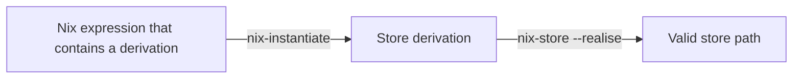
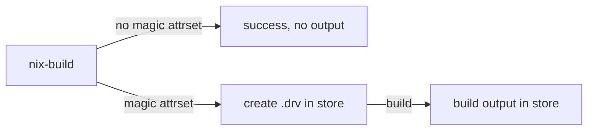

# Summary
[summary]: #summary

The NixOS Project started out as a research. In typical research fashion, it establishes the basic terminology first, and the builds concepts on top of that. This bottom-up style of thinking is still dominant in the ecosystem today.

Despite being very powerful, this bottom-up approach has its flaws, too. It leads to a number of long-standing issues within the NixOS Project that have been called out frequently:

- There's a high barrier to entry. This is a very multifaceted issue, and it comes down to:
  - "Day one" operations (such as installing a package, uninstalling a package, updating) being described very poorly. This issue is largely solved thanks to the excellent work of Documentation Team
  - "Day two" operations (such as overriding a package, packaging something new, organizing NixOS configuration) being described very poorly, or not at all. This issue is steadily getting better, especially with the [nix.dev](https://nix.dev) effort and [official wiki](https://wiki.nixos.org)
  - Existing learning materials not providing *explanations*. People learn how to *do something* with Nix, but they don't build the intuition for what they are doing. As a result, they have a really hard time solving the issues that occur
- Some of the concepts are notoriously hard to grasp even for experienced Nixers. "Derivation" is a strong example of that
- A lot of concepts are *intentionally left unexplained*. An extremely common explanation of "derivation" is "it's just a package, don't worry about it". The reason for that is because it's really hard and time-consuming to explain the details

Overall, we as a community are too fixated on having technically correct terminology. While this isn't a bad goal, we do it to such an extent that we ignore user stories and overcomplicate things for the sake of correctness.

This RFC aims to, in order of importance:

1. Raise a discussion about these problems.
2. Provide an alternative, focusing more on explanations rather than rigorous definitions. This also includes culling of a lot of widespread definitions that don't end up being useful.
3. Raise a discussion about the remaining terms. Discuss their necessity and consider renaming to something that aligns better with the explanation-guided approach.

# Motivation
[motivation]: #motivation

The NixOS Project has long left the walls of academy, and is now a general-use product. As such, we should focus on making the project more user-friendly. Sticking to the formal rules of the academy just won't be enough.

Clearing up the terminology will allow us to have more productive conversations about Nix, and would solve the issues many key parties experience:

- Veterans commonly have to specify what part they are specifically talking about, leading to extra time spent on agreeing on the terminology
- Beginners often get confused on the terminology and naming
- Teachers have to go on tangents related to terminology and naming, wasting precious time and capacity of their students on complicated terminology instead of education

Additionally, rethinking the terminology and naming would benefit SEO, as well as improve the experience of discovering Nix-related materials with search engines. Currently, there are a few issues with doing that:

- Depending on your locale, location and other variables, you may encounter unrelated search results. This is because the name "Nix" is also used by other things: [Wikipedia-compiled list](https://en.wikipedia.org/wiki/Nix)
- Issues that can be attributed to Nix package manager or Nixpkgs are easier searched with "NixOS" in query rather than "Nix". This is partly because the users of Nix and NixOS overlap, and partly because "NixOS" is just a more concrete term to search by
- The official NixOS website can be confused with the similarly-named porn website

# Detailed design
[design]: #detailed-design

## Problem statement

There's a lot of terminology in the Nix build process that is still used, but isn't very helpful. Let's look at the basic Nix build process:

Here, we see the crux of the issue. There are a total of **six** terms introduced here: [derivation](https://nixos.org/manual/nix/stable/glossary#gloss-derivation), [instantiation](https://nixos.org/manual/nix/stable/glossary#gloss-instantiate), [store derivation](https://nixos.org/manual/nix/stable/glossary#gloss-store-derivation), [realisation](https://nixos.org/manual/nix/stable/glossary#gloss-realise), [store path](https://nixos.org/manual/nix/stable/glossary#gloss-store-path) and [valid](https://nixos.org/manual/nix/stable/glossary#gloss-validity). Indirectly, we are also introducing *nine* more terms: [store](https://nixos.org/manual/nix/stable/glossary#gloss-store), [store path](https://nixos.org/manual/nix/stable/glossary#gloss-store-path), [store object](https://nixos.org/manual/nix/stable/glossary#gloss-store-object), [substituter](https://nixos.org/manual/nix/stable/glossary#gloss-substituter), [binary cache](https://nixos.org/manual/nix/stable/glossary#gloss-binary-cache), [output path](https://nixos.org/manual/nix/stable/glossary#gloss-output-path), [closure](https://nixos.org/manual/nix/stable/glossary#gloss-closure), [content-addressed derivation](https://nixos.org/manual/nix/stable/glossary#gloss-content-addressed-derivation) and [Nix database](https://nixos.org/manual/nix/stable/glossary#gloss-nix-database). That's 15 terms to understand how the build works!

The worst part is, even if you take your time to read all the 15 definitions and piece together the meaning, you still won't understand the whole thing. The [definition for derivation](https://nixos.org/manual/nix/stable/glossary#gloss-derivation) is useless: essentially, a derivation is an *internal data format* that is used by Nix. It is an implementation detail that is mistreated as a concept that the user needs to learn.

What's most unfortunate is, this build process isn't even described anywhere. The explanation of it doesn't exist in [Nix store chapter](https://nixos.org/manual/nix/stable/store/) of the manual; it's not in [package management chapter](https://nixos.org/manual/nix/stable/package-management/) either; [architecture overview](https://nixos.org/manual/nix/stable/architecture/architecture#overview) doesn't touch on it in detail either. You have to look at the [nix-build man page](https://nixos.org/manual/nix/stable/command-ref/nix-build) to see that it is a wrapper around `nix-instantiate` and `nix-store --realise`, and then you should look at the man pages for [nix-instantiate](https://nixos.org/manual/nix/stable/command-ref/nix-instantiate) and [nix-store --realise](https://nixos.org/manual/nix/stable/command-ref/nix-store/realise) to reconstruct the build process flow.

To recap, in order to truly understand the build process of Nix, you would need to:

1. Read the man page for `nix-build`
2. Read the man page for `nix-instantiate`
3. Read the man page for `nix-store --realise`
4. Put together the contents of those man pages to get the accurate flow of `nix-build`
5. Read 15 glossary definitions to formalize your knowledge
6. Give up on trying to understand what is the derivation, because it's essentially just a type in Nix language

This is an unacceptable amount of indirection for understanding how the build process works. The build process that Nix uses isn't complicated, and it is also not part of the advanced functionality: building packages is a basic functionality of a package manager. The complexity here comes not from the underlying mechanism, but from the way knowledge is structured: instead of an explanation, the user is offered formal definitions that link to other formal definition. Instead of reading a comperehensive summary or looking at a graph (like the one provided earlier), the user needs to play detective, putting clues from different sources together to form a coherent picture.

Part of the issue comes from the format of a *manual*. Manuals are commonly focused on theory with some practical examples. Good manuals have a set of [practical examples](https://diataxis.fr/how-to-guides/), some reasonable [explanations](https://diataxis.fr/explanation/) and a complete [reference](https://diataxis.fr/reference/). We have fine examples, and our reference is incredibly rich (but a little hard to read due to the amount of links to terms that we have). But explanations are *pretty much non-existent*.

Another learning resource worth discussing is [nix.dev](https://nix.dev). It makes heavy use of the [Diataxis framework](https://diataxis.fr/) of structuring documentation. It provides excellent tutorials and guides. For reference materials, it links to the Nix manual and other manuals. But explanations are, once again, lacking: there are only two entries in [explanation-focused part](https://nix.dev/concepts/#concepts).

Lastly, there are [Nix Pills](https://nixos.org/guides/nix-pills/index.html). They are a little old, but they are still regarded as a good read. There's a good reason for it: Nix Pills focus extensively on [tutorials](https://diataxis.fr/tutorials/) and [explanations](https://diataxis.fr/explanation/). The series helps you *understand* things. It even [describes derivations](https://nixos.org/guides/nix-pills/our-first-derivation)!

In short, there're lots of materials that teach you how to *use* Nix. There's also a large and extensive reference that *describes Nix itself*. However, for materials that *make you understand Nix* - there's a giant void. This seems to suggest that there's a large gap between *using* Nix and *understanding* Nix. This gap seems to be the reason why Nix is considered **difficult**.

To be clear, the issue isn't *just* as lacking good explanation materials. The issue is also our reference material being only useful to people that already know what they want and need. Nix manual is quite useless if you don't already *understand* Nix - and there's barely anything that helps you do that.

There are two problems at play: we don't have explanation materials, and our reference is exceedingly unhelpful. What follows is a discussion on how to solve those problems.

## Adding explanations

This is part of the responsibility of [Documentation Team](https://nixos.org/community/teams/documentation/). Some of the possible actions include:

- Adding more explanations to [nix.dev](https://nix.dev/)
- Migrating useful explanations from [Nix Pills](https://nixos.org/guides/nix-pills/) to [nix.dev](https://nix.dev/)

Overall, this part is already handled by the Documentation Team. The discussion surrounding adding explanations should be held as part of it. This discussion is out of scope of this RFC.

## Restructuring Nix manual

While this is also part of the responsibility of [Documentation Team](https://nixos.org/community/teams/documentation/), there's a lot of value in discussing the issue very publicly in this case. As demonstrated above, the manual contains very little helpful information as a result of conforming to a bottom-up design. Man pages that redirect you to other man pages, that in turn redirect you to glossary definitions, that can also redirect you to other glossary definitions, is a direct consequence of that.

We should re-evaluate how we think about the Nix manual in its entirety, and we should focus much more on the top-down format. Let's discuss the build process again, keeping the goal of simplification in mind:

1. There is a `nix-build` command. This command takes in a file with Nix code, and produces an *optional* output
2. There's *some* output only when the code uses a special function, `builtins.derivation`. Otherwise, the output is *none* - the command will finish succesfully, but nothing will be built!
3. `builtins.derivation` is a convenience function that creates an attribute set with some magic attributes. Attribute sets with those magic attributes can be built with Nix. So basically, Nix looks for attribute sets with those magic attributes, and builds them
4. The build itself has two stages: evaluation stage and build stage. Evaluation stage creates a `.drv` file in the store, which contains a build plan. The build stage executes this build plan to create our output in the store
5. To recap: `nix-build` takes Nix code, and if this Nix code contains an attribute set with some magic attributes - it puts a `.drv` file in the store, as well as the build output

Notice how this top-down approach helps. It introduces new concepts as they appear; it also highlights how arbitrary some of the conventions are (what is a "derivation", and what is a `.drv` file). The explanation is self-contained, and it provides a clear path from start to finish. It is also easy to extend - adding new magic attributes to "derivation" requires just listing them in reference, and a lot of the things mentioned can be explained separately - such as why we even want to have "build plans" in the store, or what things can and can't be done in evaluation/build stages.

This also lets us build a flowchart that's easy to parse at a glance:

Reading the flowchart doesn't require familiarizing yourself with 15 terms, either.

## Rethinking terminology

When we have explanations, we can afford to rethink a lot of the terminology that we are currently using. Terminology is harmful to an explanation - it takes time to understand what the term means, and to get used to it. Explanation also bridges practice with understanding. That means that we no longer require the terminology to be vast and technically accurate for people to understand what is happening.

Simply put, rigorously defining a "derivation" isn't necessary, when the intuition of "it's just an attrset with some magic attributes" is in place. It can be useful to have a word for it, so that we can talk about a concept without a long explanation beforehand, but it's no longer a basis of our documentation.

Concretely, we can finally give a useful definition to the word "derivation":

> An attribute set with some magic parameters. When Nix package manager evaluates it, it also creates a .drv file in the store with the evaluated contents. This .drv file can then be built with Nix package manager. Derivations are often created with an utility function `builtins.derivation`, or - more commonly - one of the library functions from Nixpkgs, such as `lib.mkDerivation`.

This definition is also self-contained and clear. It's not as formal and rigorous, but it's a lot more readable as a result. We don't reference a definition for "store derivation", or "store path", either.

This approach also helps us explain some of the trickier terms:

> IFD (Import From Derivation) is a pattern in Nix Language. This pattern occurs when you pass a derivation to a built-in function that reads from filesystem. Those functions are executed at the evaluation stage. When they depend on a derivation, the evaluation has to be paused, and the derivation has to be evaluated and built first. Essentially, IFD occurs when your evaluation depends on the build result of something else.
> FOD (Fixed-Output Derivation) is a derivation that has optional attributes `outputHash`, `outputHashAlgo` and `outputHashMode`. These attributes allow you to specify the expected hash of the contents in advance. This expected hash will be compared with the actual hash of the contents. This is useful for making internet downloads reproducible: if the link stays the same, but the contents change, the hashes will be different and the build will fail. Additionally, if the URL changed (such as when the original server is down), but the contents are the same - the hashes will match, and nothing will be rebuilt.

Interestingly, this also opens up the conversation about the necessity of those terms. When we focus on the whole picture instead of concrete definitions, we are able to reframe the problem entirely.

It is very possible that we'll no longer need the terms "IFD" and "FOD". Perhaps, those terms aren't even needed: they don't describe a concept, they merely describe the properties of established concepts. Perhaps we can do a better job at explaining those established concepts, which will lend itself naturally into describing the corner cases such as IFD and FOD.

Lastly, there's an opportunity to rethink our naming. Perhaps there's an opportunity to come up with a much more descriptive name, once we're less focused on having strict definitions. Here are some potential things that can be discussed:

- Consider renaming IFD (Import From Derivation). Here are possible options:
  - Import From Store Path (IFSP)
    - A mouthful to say
    - A lot more descriptive than IFD, because IFD involves importing from what is not commonly understood as a derivation
  - Import From Store Object (IFSO)
    - A little easier to pronounce
    - Brings up the question of "what is the store object". "Store object" isn't very commonly used outside of the manual
  - Other options brought up in <https://github.com/NixOS/nix/issues/8450>
  - Eval Runtime Result (ERR)
    - Sounds weird
    - Isn't very descriptive
  - Other options. This is an open question
- Consider renaming FOD (Fixed-Output Derivation). Here are possible options:
  - FOD (leave it as is)
    - This still contains the word "derivation", which we want to get rid of
    - "Fixed-Output" isn't very descriptive. Every derivation has fixed output: that's just purity. The difference between FOD and regular derivations isn't clear from name only
    - The primary difference between FOD and regular derivations in practice is that FODs specify the output hash in advance. To calculate the hash, you need to first execute the FOD. The practical difference here is that you can only construct a working FOD after executing it once
  - Well-Known Store Path (WKSP)
    - This is a big mouthful, due to containing only consonants
    - It might not be "well-known" - FOD might be unbuildable due to expecting a hash that is impossible to engineer until SHA256 is broken
  - Fixed-Output Store Path (FOSP)
    - Similar in spirit to FOD
    - Doesn't address the "Fixed-Output" confusion"
  - Fetcher
    - Describes the usual use case, which is a benefit
    - Isn't very clear otherwise. We want to make clear that this is a conceptually different kind of store path, not just something that "does fetching"
  - "Validator" pattern
    - Hints at what the usecase for FOD is: validating that a result matches expectation
    - Isn't particularly descriptive otherwise
  - Other options. This is an open question

## Rethinking ecosystem names

There are a few issues present:

- "Nix language" and "Nix package manager" are both commonly referred to as just "Nix". It is not always clear from the context which is being talked about, and it's unnecessarily confusing
- Further, "Nix package manager" isn't an official term that exists. We just have "Nix", which is a package manager, and the distributed package includes a daemon and a CLI to interact with it
- Nixpkgs repository is very awkwardly named. When spelled out, "Nixpkgs" sounds the same as "Nix packages". This makes it hard to introduce people to Nix with audio presentation

There is also an issue with NixOS/Nix naming confusion. The project is "NixOS Project", but there are also mentions of "Nix community". This issue is worth mentioning, but it already has [an existing effort working towards solving it](https://github.com/nix-rfc-canonical-domain/rfcs).

Here's the solution proposed:

- Enforce the usage of "Nix Language" terminology. It's already used a lot across the documentation, just not consistently
- Nix project should be given a better name to reflect what it does. Nix project can be renamed to "Nix package manager", or to "NixPM", whichever is preferred. That would involve renaming the Github repository. Nix package manager includes a daemon implementation, as well as a CLI tool to interact with the daemon
- Enforce the usage of "Nixpkgs repository" terminology. It's too costly to rename the Github repository; that said, it's worth emphasizing that Nixpkgs is just a Github repository in our documentation. That would also solve the possible confusion in speech and for beginners

# Examples and Interactions
[examples-and-interactions]: #examples-and-interactions

Examples of Nix being confusing (and explained) (taken from [NixOS wiki](https://wiki.nixos.org/wiki/Resources) and memory):

<https://fasterthanli.me/series/building-a-rust-service-with-nix/part-9> - describes the build process (instantiate-realise-done) in detail; note how it becomes a lot less essential with "installables" school of thought

<https://xeiaso.net/talks/2024/nix-docker-build/> - audio talk; it's noteworthy that it has the obligatory slide and a paragraph explaining the relationship between NixOS Projects, when most of them aren't essential to the topic of the talk. There are two more talks relevant to discussion: [one](https://xeiaso.net/talks/asg-2023-nixos/), [two](https://xeiaso.net/talks/nixos-pain-2021-11-10/)

<https://ianthehenry.com/posts/how-to-learn-nix/glossary/> - a single post from a series, where a newcomer to Nix describes their experiences. The whole series is worth a read, but for the purposes of this RFC it's noteworthy how confusing the term "derivation" was (and continued to be)

Nix also is commonly called a package manager (that installs packages). This is not wrong, but the jump between "install packages" and "realises store paths from derivations" is huge; more than the jump from "install packages" to "packages are just one type of installables". Here's the list of resources that simplify Nix as a package manager:

<https://wiki.nixos.org/wiki/Nix_package_manager>

<https://nixos.org/manual/nix/stable/introduction>

<https://nix.dev/reference/glossary>

# Drawbacks
[drawbacks]: #drawbacks

- Naming bikeshedding. This is a big concern, and that's why the most important part of the RFC is to identify which things needs changing. Discussing the name to be used instead can come later
- A lot of effort to edit the official documentation
- A lot of the existing content, especially in the form of blog posts, will get bitrotten away

# Alternatives
[alternatives]: #alternatives

- Leave everything as is
- Improve our documentation. Unfortunately, it only goes so far if the names and terms used are still arcane

# Prior art
[prior-art]: #prior-art

TODO

# Unresolved questions
[unresolved]: #unresolved-questions

TODO

# Future work
[future]: #future-work

TODO
