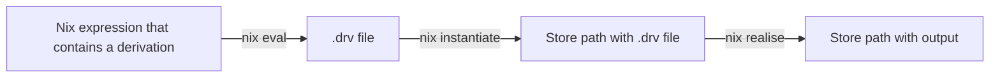

# Summary
[summary]: #summary

Historically, the terminology and naming used in the NixOS project had been subpar. This includes, but is not limited to, the following issues:

- Overloaded terms, such as "derivation" (can mean a .drv file in Nix store, a temporary .drv file, a package, or even a dependency - FOD or IFD)
- Overloaded names. The common example is Nix DSL and Nix package manager being called just "Nix"
- Confusing names, such as "Nixpkgs". When you say it out loud in English, it sounds indistinguishable from "Nix packages", which leads to issues when giving audial presentations

This RFC aims to, in order of importance:

1. Identify problematic terms and names that the community agrees on
2. Settle on better terms or names to be used
3. Develop a plan on how to handle the transition to new terms and names

# Motivation
[motivation]: #motivation

Clearing up the terminology will allow us to have more productive conversations about Nix, and would solve the issues many key parties experience:

- Veterans commonly have to specify what part they are specifically talking about, leading to extra time spent on agreeing on the terminology
- Beginners often get confused on the terminology and naming
- Teachers have to go on tangents related to terminology and naming, wasting precious time and capacity of their students on complicated terminology instead of education

Additionally, rigorously defining the terminology and naming would benefit SEO, as well as improve the experience of discovering Nix-related materials with search engines. Currently, there are a few issues with doing that:

- Depending on your locale, location and other variables, you may encounter unrelated search results. This is because the name "Nix" is also used by other things: [Wikipedia-compiled list](https://en.wikipedia.org/wiki/Nix)
- Issues that can be attributed to Nix package manager or Nixpkgs are easier searched with "NixOS" in query rather than "Nix". This is partly because the users of Nix and NixOS overlap, and partly because "NixOS" is just a more concrete term to search by
- The official NixOS website can be confused with the similarly-named porn website

# Detailed design
[design]: #detailed-design

## Build terminology

There's a lot of terminology in the Nix build process that is still used, but isn't very helpful anymore. Let's look at the basic Nix build process:

This is usually done implicitly by the `nix build` command. However, there's a lot more complexity at hand! Let's look at some of the caveats that can apply:

- Nix expression doesn't necessarily contain a derivation. Using `nix eval` to evaluate it will produce a result without producing a .drv file
- Nix can be configured to not keep .drv files in the store using a setting `keep-derivations` (default is `true`)
- Fixed-Output Derivations, or FODs, are mostly not about derivations. They are about a type of store path that has a well-known hash that is compared with the actual hash
- Import From Derivation, or IFD, isn't about derivations, either! It is about reading data from a store path
- Packages that exist in Nixpkgs are often called "derivations", despite the existence of a buildspec in .drv file being an implementation detail
- Nix store outputs that aren't exposed in Nixpkgs are called "derivations". Examples include store paths passed to `src`, symlink farms and other kinds of store paths used in implementation, but not exposed to the end user

In summary, "derivation" concept is an implementation detail. The term, however, is applied to many user-facing scenarios. As a result, the term becomes overloaded, confusing and difficult to comprehend. We should treat derivations as an implementation detail.

Continuing on the topic of derivations, it is clear that store path outputs aren't always directly produced by a derivation. It is not very useful to think in "derivation -> output" chains. Instead, we can use a term "installable" that is [already established](https://nixos.org/manual/nix/stable/command-ref/new-cli/nix#installables) to simplify the terminology:

- `nix build` is a command that converts an installable to an output store path or fails. It is a simple "input -> output" relationship
- In this model, what is written to the store (aside from the output) are just *dependencies*. This includes plain dependencies (like software libraries), FODs, implementation-based store paths and .drv files
- Installables are usually packages or runnable scripts. That makes them easy to conceptualize, and might give additional intuition into the future Flake transition. The current unstable schema for Flakes uses installables for all outputs. That said, Flakes also allow definining custom outputs that can be arbitrary

With all that reasoning, here are the actions proposed:

- Rename IFD (Import From Derivation) to IFSP (Import From Store Path)
- Rename FOD (Fixed-Output Derivation) to WKSP (Well-Known Store Path)
- Converge on using "package" term for introductory materials
- Converge on using "installable" term for more advanced materials. This includes cases when an installable is a runnable script, such as when building a closure of NixOS system. The term should also be used in manuals and references
- Rename "derivation" to "derivation file", keeping the current definition. Define "derivation" as "an old term that is no longer used, which usually means derivation files"
- Treat every other usage of the word "derivation" as **incorrect documentation**
- Remove the word "instantiate". For all intents and purposes, "instantiation" is just putting a derivation file into Nix store; this is an implementation detail
- Replace the words "realise", "realisation" with "install", "installation". Nix operates on installables, and it installs them; there's no need for an arcane term
- Rename `lib.mkDerivation` function to `lib.mkPackage`. While mkDerivation can be used for defining FOD or IFD, it usually isn't, so we dodge the edge cases where "derivation is not technically a package"
- Rename `builtins.derivation` to `builtins.drvFile`

## Projects

There are a few issues present:

- "Nix language" and "Nix package manager" share the name "Nix"
- Further, "Nix package manager" isn't an official term that exists. We just have "Nix", which is a package manager, and the distributed package includes a daemon and a CLI to interact with it
- Nixpkgs repository is very awkwardly named. When spelled out, "Nixpkgs" sounds the same as "Nix packages". This makes it hard to introduce people to Nix with audio presentation
- There isn't consistent naming for the community and its activities. Looking at the [community page](https://nixos.org/community/), we can see the following used:
  - The website itself is under domain nixos.org (implying that related organization/community is NixOS)
  - "Nix community" is used to describe the whole community
  - The official Matrix space is also hosted under nixos.org
  - Mastodon and Twitter, which are described as "official spaces", are also tagged under NixOS
  - Stackoverflow link to "official space" looks for tags: "Nix", "Nixpkgs", "NixOS", "NixOps"
  - NixCon is named after Nix, not NixOS
  - The link under "RFC process" leads to the official organization on Github, which is called NixOS
  - Under the "foundation board" entry, "NixOS project" is mentioned
  - Under the "security team" entry, "NixOS community" is mentioned
  - Under the "infrastructure team", both "Nix community" and "NixOS community" are mentioned; likewise for "NixCon team"
  - Under the "marketing team", "Nix user base" is mentioned
  - Under the "CUDA team", both "Nix" and "NixOS" are mentioned
  - There's a "Nix team", which is responsible for Nix package manager specifically; makes sense
  - There's a "Nix formatting team", which creates a standard format for "Nix". It is ambiguous if the team creates a standard format for Nix package manager or for Nix DSL
  - NixOS Foundation is mentioned, which once again suggests that the project is NixOS

Here's the solution proposed:

- Give an official name to Nix DSL. One of the proposed names is just "Nix DSL". A very popular alternative is "NixLang", similar to Go/Golang
- Nix DSL should be recognized as a distinct part of the NixOS Project. It should have its own manual entry, and it should also have a dedicated repository. The repository should contain the specification to Nix DSL, and optionally a reference interpreter of Nix DSL
- Nix project should be given a better name to reflect what it does. Nix project can be renamed to "Nix package manager", or to "NixPM", whichever is preferred. That would involve renaming the Github repository. Nix package manager includes a daemon implementation, as well as a CLI tool to interact with the daemon
- Nixpkgs should be renamed. Options include "nix-package-collection", "nix-package-registry", and the like
- Community, activities and the like should be consistently named "NixOS". The reason for that is two-fold: "NixOS" seems to be the more popular variant, and it's also the one that has more infrastructure and investment into it. The foundation is already called after NixOS, and renaming it is troublesome; likewise, the domain already is nixos.org , and moving domains is also troublesome
- A possible exception to that might be NixCon. NixOSCon sounds like a mouthful, and having an exception or two is acceptable, as long as we are recognizable (keep the "Nix" part) and get rid of other sources of confusion
- Another possible exception is nix.dev website

# Examples and Interactions
[examples-and-interactions]: #examples-and-interactions

Examples of Nix being confusing (and explained) (taken from [NixOS wiki](https://wiki.nixos.org/wiki/Resources) and memory):

<https://fasterthanli.me/series/building-a-rust-service-with-nix/part-9> - describes the build process (instantiate-realise-done) in detail; note how it becomes a lot less essential with "installables" school of thought
<https://xeiaso.net/talks/2024/nix-docker-build/> - audio talk; it's noteworthy that it has the obligatory slide and a paragraph explaining the relationship between NixOS Projects, when most of them aren't essential to the topic of the talk. There are two more talks relevant to discussion: [one](https://xeiaso.net/talks/asg-2023-nixos/), [two](https://xeiaso.net/talks/nixos-pain-2021-11-10/)
<https://ianthehenry.com/posts/how-to-learn-nix/glossary/> - a single post from a series, where a newcomer to Nix describes their experiences. The whole series is worth a read, but for the purposes of this RFC it's noteworthy how confusing the term "derivation" was (and continued to be)

Nix also is commonly called a package manager (that installs packages). This is not wrong, but the jump between "install packages" and "realises store paths from derivations" is huge; more than the jump from "install packages" to "packages are just one type of installables". Here's the list of resources that simplify Nix as a package manager:

<https://wiki.nixos.org/wiki/Nix_package_manager>
<https://nixos.org/manual/nix/stable/introduction>
<https://nix.dev/reference/glossary>

# Drawbacks
[drawbacks]: #drawbacks

- Naming bikeshedding. This is a big concern, and that's why the most important part of the RFC is to identify which things needs changing. Discussing the name to be used instead can come later
- A lot of effort to edit the official documentation
- A lot of the existing content, especially in the form of blog posts, will get bitrotten away

# Alternatives
[alternatives]: #alternatives

- Leave everything as is
- Improve our documentation. Unfortunately, it only goes so far if the names and terms used are still arcane

# Prior art
[prior-art]: #prior-art

TODO

# Unresolved questions
[unresolved]: #unresolved-questions

- What do we do with Nix Pills?

# Future work
[future]: #future-work

Need to rewrite parts of the existing documentation
