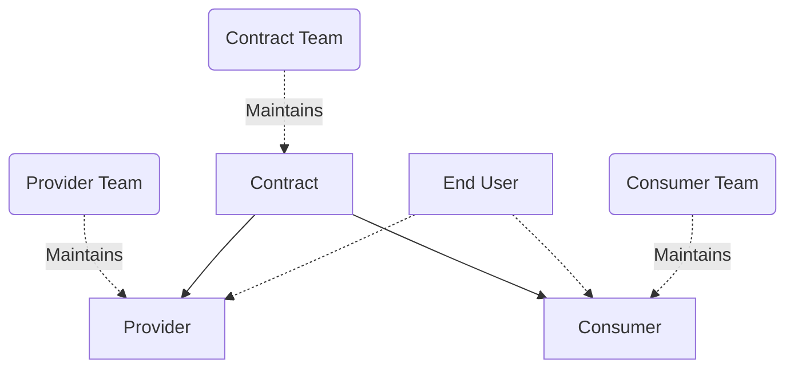
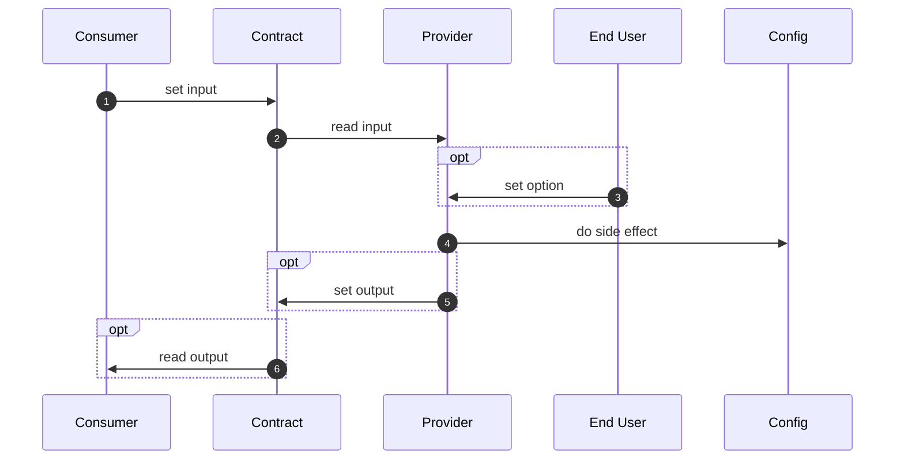

# Summary

In nixpkgs, modules include a lot of duplicate code to set up their dependencies.
We introduce a pattern for moving this custom code out of the modules and making it shareable
in an incremental, backwards-compatible, extensible, and testable way.

# Motivation

As a motivating example, let's take a module
that sets up a service that needs a database
which can be PostgreSQL or MySQL.
Letting the user choose which database they want to use
is a great feature to have for a module, but it requires
a lot of code that has nothing to do with the module's core functionality,
and is difficult to get right and to test thoroughly.

Having this code live in each separate module is a waste for the whole community.
We see many disadvantages:

- It's more code to review and maintain for everybody.
- Increased burden on maintainers for every module implementing this feature:
  they must know how to set up their dependencies at a low level,
  and must keep that code up to date.
- Setting up the same dependency across different modules can use an entirely different interface.
- Every maintainer has their own style and knowledge,
  leading to large variations in quality and reliability across implementations.
- As a consequence of maintainer burden, very few modules allow you to choose from multiple dependencies (e.g. PostgreSQL, MySQL or other).
- Dependencies can't be changed or extended without changing the module's source code:
  a user cannot easily choose to use a dependency the maintainer didn't add code for (e.g. SQLite).

This proposal resolves all those issues, as well as allowing a few things that are not currently possible:

- Interfacing with dependencies and services outside of NixOS,
- Using stubs in NixOS tests.

# Detailed design

The core idea is to decouple the use of a feature from its implementation.

Let's first introduce some nomenclature:

- _consumer_: The module using or needing a feature.
  Example: Nextcloud, Vaultwarden and others require a database.
- _provider_: The module implementing a feature.
  Example: PostgreSQL, MySQL, or SQLite provide database services.
- _inputs_: The set of options the consumer uses to communicate with the provider.
- _outputs_: The set of options the provider uses to communicate back to the consumer.
- _contract_: The concept sitting between a consumer and provider
  defining the `inputs` and `outputs`.

The _contract_ is a submodule with imposed options
associated with a behavior which every _provider_ must respect
and which is enforced through generic NixOS tests.
A _consumer_ and _provider_ can then fit together thanks to structural typing
in the contract, enforcing matching `inputs` and `outputs` on each side.

Structural typing was chosen because it fits nicely with
the existing module system. This follows the self-imposed constraint
of maintaining as much backwards compatibility as possible.
Indeed, this design can be added to existing modules incrementally
,and in a backwards-compatible way,
by adding a new option with the contract name
which will translate options from the contract
into options already defined by the existing module.

Some examples of possible contracts:

- File backup
- Streaming backup (for databases)
- Secrets (out of store values) provisioning
- SSL certificate generation
- Database setup (ensuring a database and user exist)
- Reverse proxy setup
- Reverse proxy "chain" allowing transparent traffic inspection
- LDAP user and group management
- OIDC provider integration
- Forward auth setup

Any implicit convention in nixpkgs can be encoded this way.

This RFC's goal is _not_ to define all these contracts
nor to identify an exhaustive list of existing contracts, but to define a pattern derived from a few diverse examples.

These contracts will live under a new option path `contracts`
like `contracts.fileBackup` and `contracts.streamingBackup`.

See [prior art] for some useful comparisons that can help you get a better picture.

# Implementation

The implementation was worked out initially in the [SelfHostBlocks] repo and perfected in the [module interfaces] repo.
There are some slight variations proposed in this RFC relative to the module interfaces repo to get it out sooner rather than later. See the [corresponding unresolved section](#dual-link).

It is important to keep in mind that the proposed implementation comes from
seeing this pattern emerge naturally "in the wild" from trying to increase code reuse, providing solid evidence on the utility of this approach.

## Actors

Before looking at the code, it is useful to get a mental model of the actors involved.
There are up to 4 different individuals or teams involved for one contract:



1. `Contract Team`: The team maintaining a contract.
1. `Provider Team`: The team maintaining one module provider of that contract. Each provider of a same contract can have its own team.
1. `Consumer Team`: The team maintaining one module consumer of that contract. Each consumer of a same contract can have its own team.
1. `End User`: The end user linking one consumer of their choice with one provider of their choice for that contract.

Note that the `Contract` is the central component here.
The provider and the consumer teams do not need to know what the other team is doing,
they can simply follow the contract, and it will guarantee interoperability.

One nice property here is the `End User` can add a new provider or consumer themselves.

A module can consume or provide multiple instances of the same or different contracts, for example a single HTTP server module might provide `Web Server` and `Reverse Proxy` contracts.

## Data Flow

Another consideration before looking at the code is how data flows through a contract.



1. A `Consumer` sets the `input` option of the contract.
1. The `Provider` reads from that `input` option.
1. The `Provider` optionally accepts provider-specific options set by the `End User`.
1. The `Provider` does some side effect (otherwise, there's no point).
1. The `Provider` optionally writes to the `output` of the contract.
1. The `Consumer` optionally reads from the `output` of the contract.

If you squint, this looks just like a functional application, only applied at the module level.

## Contract Interface

_The following snippets are taken from the [draft PR][draftpr]._
_The intended reading order is first this document, then the PR._

Links to relevant commits:

- [contracts: init underlying module](https://github.com/NixOS/nixpkgs/pull/432529/commits/bb561e9927ff73be12122644362ec3a1af61fd20)
- [contracts: add option to declare behavior tests](https://github.com/NixOS/nixpkgs/pull/432529/commits/75be2ddbc5b260a2a2e7f03c0103af803f54879b)
- [contracts: allow consumer to be unset](https://github.com/NixOS/nixpkgs/pull/432529/commits/891ef82cf57bf31f7f4c02fae6d9739147af1753)

We declare a new top-level option `contracts` of type `attrsOf (submodule ...)`.
Each contract will define a new value for this option.

With the `description` fields removed for brevity, the option is declared like so:

```nix
{ lib, ... }:
let
  inherit (lib) mkOption;
  inherit (lib.types) attrs attrsOf submodule listOf str deferredModule optionType;
in
{
  options.contracts = mkOption {
    type =
      attrsOf (
        submodule (interface: {
          options = {
            meta = mkOption {
              type = submodule {
                options = {
                  maintainers = mkOption {
                    type = listOf str;
                  };
                  description = mkOption {
                    type = str;
                  };
                };
              };
            };
            input = mkOption {
              type = deferredModule;
            };
            output = mkOption {
              type = deferredModule;
            };
            consumer = mkOption {
              type = optionType;
              readOnly = true;
              default = submodule (consumer: {
                options = {
                  provider = mkOption {
                    type = interface.config.provider;
                  };
                  input = mkOption {
                    type = submodule interface.config.input;
                  };
                  output = mkOption {
                    type = submodule interface.config.output;
                    readOnly = true;
                    default = consumer.config.provider.output;
                  };
                };
              });
            };
            provider = mkOption {
              type = optionType;
              readOnly = true;
              default = submodule (provider: {
                options = {
                  consumer = mkOption {
                    type = lib.types.nullOr interface.config.consumer;
                    default = null;
                  };
                  input = mkOption {
                    type = lib.types.nullOr (submodule interface.config.input);
                    readOnly = true;
                    default = provider.config.consumer.input or null;
                  };
                  output = mkOption {
                    type = submodule interface.config.output;
                  };
                };
              });
            };
            behaviorTest = mkOption {
              type = attrs;
            };
          };
        })
      );
  };
}
```

Let's review this submodule option by option.

- `meta`: Standard option to add some meta information to a contract.

The following two options are only used when defining a new contract.

- `input`: Input options for the contract. `deferredModule` in the inherited types allows for the options to be declared independently in each contract.
- `output`: Output options for the contract, with the same use of `deferredModule`.

Now that we have the ability to declare the `input` and `output` options of a contract,
we can declare matching `consumer` and `provider` options using dependent types.

- `consumer`: Submodule option with 3 nested options:

  - `provider`: The linked `provider` for this consumer.
    This has to be set by the `end user` as they choose which consumer and provider to link.
  - `input`: An option whose type comes from the top-level `input` `deferredModule`.
    This option is made writable because the `consumer` is expected to write to it.
  - `output`: An option whose type comes from the top-level `output` `deferredModule`.
    This option is made `readOnly` because the `consumer` should only read from it.
    Its default value comes from the linked `provider`'s `output`.

- `provider`: Submodule option with 3 nested options:

  - `consumer`: The linked `consumer` for this provider.
    This has to be set by the `end user` as they choose which consumer and provider to link.
    This option is made nullable because the end user is not necessarily required to use a contract.
  - `input`: An option whose type comes from the top-level `input` `deferredModule`.
    This option is made `readOnly` because the `provider` should only read from it.
    Its default value comes from the linked `consumer`'s `input`.
  - `output`: An option whose type comes from the top-level `output` `deferredModule`.
    This option is made writable because the `provider` is expected to write to it.

- `behaviorTest`: A full NixOS VM test which enforces similar side effects
  for all providers of a given contract. The test is generic on the provider,
  and each provider must instantiate this generic test to verify they do indeed
  implement the declared contract. It is used to enforce any behavior not captured by the types.

The `end user` would then combine a consumer and provider like so:

```nix
config = {
  services.nextcloud.fileBackup.provider = config.services.restic.backups.nextcloud.fileBackup;

  services.restic.backups.nextcloud = {
    fileBackup.consumer = config.services.nextcloud.fileBackup;

    // Provider-specific options.
    repository = "/var/lib/backups/nextcloud";
    passwordFile = toString (pkgs.writeText "password" "password");
    initialize = true;
  };
};
```

Notice the `end user` must link the consumer and provider in both directions.
This is discussed in [the unresolved section](#unresolved-questions).

# Examples and Interactions

In this section we will explain, for each contract implemented in the PR,
why they are useful, and their interesting properties. See the PR for actual code.

## File Backup Contract

Links to relevant commits:

- [file backup contract: init](https://github.com/NixOS/nixpkgs/pull/432529/commits/a59b42345c64e5d9f793fad779dcfbc02d1918a0)
- [restic: implement file backup contract provider](https://github.com/NixOS/nixpkgs/pull/432529/commits/762a7318e3cd47f02743b46227595acf250a3084)
- [restic: define file backup contract behavior test](https://github.com/NixOS/nixpkgs/pull/432529/commits/ad5751c854c0effb2a4c5bfbb993288f755c659e)
- [nextcloud: use file backup contract](https://github.com/NixOS/nixpkgs/pull/432529/commits/6b7a87adc0b6c3d476ca6caa5d9ce4f1846049c1)

This contract is for modules that have files to be backed up.

Without this contract, a user wanting to back up a service
must know the layout of the service on the file system.
Usually there is a `dataDir` option or similar, so one
might suspect that backing this up is enough. But what if this isn't true,
and you end up making backups that can't be restored?
There is no way to know except by reading the upstream documentation.

But even then, one must also remember to use the correct user
to run the backup. If not, the backup will likely fail on first run.
Often, some files should be excluded from the backup (e.g. env files or keys)
and that's usually only found out by experience, which may happen too late.

Defining a contract allows the maintainer of the service to encode all of these subtleties,
hiding this complexity from the end user.

Embedding this information in a contract means also we have a lot of freedom in how backups are organized.
It becomes easy to back up multiple services to multiple locations using multiple different programs, as shown in this pseudocode snippet:

```nix
let
  resticConfig1 = {
    passphrase = // ...
    repositoryPath = "repo1";
  };
  resticConfig2 = {
    passphrase = // ...
    repositoryPath = "s3://repo2";
  };
  borgbackupConfig1 = {
    // ...
  };
  borgbackupConfig2 = {
    // ...
  };
in
  {
    services.nextcloud.enable = true;
    services.vaultwarden.enable = true;

    restic.backups."nextcloud-repo1" = resticConfig1 // {
      backupFile = services.nextcloud.backupFile
    };
    restic.backups."nextcloud-repo2" = resticConfig2 // {
      backupFile = services.nextcloud.backupFile
    };
    restic.backups."vaultwarden-repo1" = resticConfig1 // {
      backupFile = services.vaultwarden.backupFile
    };
    restic.backups."vaultwarden-repo2" = resticConfig2 // {
      backupFile = services.vaultwarden.backupFile
    };

    borgBackups.backups."nextcloud-repo1" = resticConfig1 // {
      backupFile = services.nextcloud.backupFile
    };
    borgBackups.backups."nextcloud-repo2" = resticConfig2 // {
      backupFile = services.nextcloud.backupFile
    };
    borgBackups.backups."vaultwarden-repo1" = resticConfig1 // {
      backupFile = services.vaultwarden.backupFile
    };
    borgBackups.backups."vaultwarden-repo2" = resticConfig2 // {
      backupFile = services.vaultwarden.backupFile
    };
  }
```

This user-defined matrix of combinations is not currently possible;
it would require at least some heavy work
by the maintainers of Nextcloud and Vaultwarden.

The behavior test creates some files somewhere, backs them up, deletes them, restores them
and finally verifies the files have been restored correctly.
To do this generically, we need a way to perform a backup and restore from it that is standardised across all providers.
This is where the idea for the `output.backupService` and `output.restoreScript` options comes from.

Although the `consumer` does not care about those two options
they can be useful to the `end user`.
They also allow creating automated backups on deploys,
and restoring from backups on rollbacks too.

## Streaming Backup Contract

Links to relevant commits:

- [streaming backup contract: init](https://github.com/NixOS/nixpkgs/pull/432529/commits/700919f0c121ef500b3ec31d5126bd677434c19d)
- [restic: implement streaming backup contract provider](https://github.com/NixOS/nixpkgs/pull/432529/commits/1d92450136106c25f1affb70817cef4bdae00c83)
- [postgresql: implement streaming backup contract consumer](https://github.com/NixOS/nixpkgs/pull/432529/commits/2e02b68087fa36f274695911789db2d10579cc3c)
- [restic: define streaming backup contract behavior test](https://github.com/NixOS/nixpkgs/pull/432529/commits/d360b941b45e5bacf0eb5b8a58825e7a51e53d4f)

For databases, and possibly other use cases, there may not be files that can be backed up.
Instead, the backup can be read from a stream, usually on stdout of some program.

Creating files from those streams, and then backing them up would allow using the `fileBackup` contract directly,
but it would be incredibly wasteful of resources, if it's even possible (e.g. it may consume excessive amounts of disk space).
To address this, we can define another contract that takes a different backup approach and thus has different `input` and `output` options.

As for the `fileBackup` contract, the test backs up a stream,
deletes the original resource and restores it, making sure it is correctly restored.
Here though, instead of engineering a stub for a stream, we use
the `streamingBackup consumer` added to `services.postgresql` directly.

## Secrets Contract

Links to relevant commits:

- [secret contract: init](https://github.com/NixOS/nixpkgs/pull/432529/commits/1bedf2dcf0960a4f33b7b7394aad51c4a3e436ae)
- [secret contract: declare behavior test](https://github.com/NixOS/nixpkgs/pull/432529/commits/a14ec6ee6cb2205d7125dfa38f305838f8ce11ac)

To pass credentials to a target host for deployment,
the most common (as far as the author of this RFC knows) way to do this
is to encrypt the secret (possibly in the nix store)
and on activation decrypt it to an agreed-upon location on the file system.

Currently in nixpkgs, most of the modules that require one or more secrets
define a global option that accepts a file containing all the secrets
in a given format. Usually the module uses the `systemd.services.<name>.serviceConfig.EnvironmentFile` option under the hood, using [dotenv](https://www.dotenv.org/docs/security/env.html) format. Failure to provide the file in the correct format
will result in an error at deploy time.

Some services go the extra mile and provide one option per secret
and accept a path to a file that contains the raw secret like [kadmin](https://github.com/NixOS/nixpkgs/blob/nixos-25.05/nixos/modules/services/security/kanidm.nix)'s
`adminPasswordFile` option. They implement some machinery to transform this file
in the expected format by the upstream service.
This moves the possible failure at evaluation time which is a very nice property.

_Aside: This is such big step forward in user experience that we would like_
_to see this more readily available. This will be tackled in the [vars](https://discourse.nixos.org/t/vars-a-framework-for-managing-secrets-and-computed-values/62411) proposal_
_and **not** in this RFC. The `vars` proposal will use the secrets contract_
_as presented here, or in a slightly modified if deemed necessary._

One problem encountered by those modules providing one option per secret
is that the file must be readable by the user of the service.
This is often solved by relying on [systemd's credentials](https://systemd.io/CREDENTIALS/) system
or less securely by using the `root` user in the service startup to read from the file.

This contract provides an alternative where the `consumer` of the contract — the module requiring a secret — imposes a `user` on the secret `provider`, which here would be [agenix](https://github.com/ryantm/agenix) or [sops-nix](https://github.com/Mic92/sops-nix) for example.

In contrast to the previous contracts we covered, the `consumer` here needs to read the `output` of the `provider`
because it contains the path to the file containing the secret.

When testing a module that expects a file containing a raw secret,
the ubiquitous method to provide the file is by using `pkgs.writeText`.
This works, but has the issue the created file is world-readable
so we do not test whether the file is accessible with the correct user.
To avoid this pitfall going forwards, we created the [`testing.hardcodedSecret`
`provider`](https://github.com/NixOS/nixpkgs/pull/432529/commits/6fbd099aa306d2cce337b8fa7ed7e0c8a255aebf)
which is an improved version of `pkgs.writeText`
where the resulting file is created with the requested `owner`, `mode`, etc.
as described by the contract `consumer`.

This new provider has been tested using the [contract's behavior test](https://github.com/NixOS/nixpkgs/pull/432529/commits/448410a520225bc71e1616611cef7ad086c64cd1)
and has been used in [`services.stash`'s module](https://github.com/NixOS/nixpkgs/pull/432529/commits/19419ad95913fbed4636d0b24d95c80517c18340) as an example.

# Drawbacks

We are not aware of any because this solution is fully backwards compatible,
incremental, and has many advantages. It also arose from a real practical need.

Care should be taken to not abuse this pattern though. It should be reserved
for contracts where abstracting away a `consumer` and `provider` makes sense.
We didn't find a general rule for that, but a good indicator of an unnecessary contract is where we only find one instance of a `consumer` and `provider` pair in the whole of nixpkgs.

# Alternatives

This design arose from trying to maximize code reuse.
We started by fiddling with nix code and the implementation emerged naturally.

We are not aware of any alternative ways to do this,
mostly because our attempts to tweak the code often led us often to infinite recursion or other module issues
so we couldn't stray too far from the way it already works.

# Prior art

We did not find any discussion about any of this by the nix community.
It is a bit self-centered, but the two talks I (`ibizaman`) gave on this subject in nixpkgs can be considered prior art.
Note the syntax in this presentation is outdated, but the underlying message remains the same:

- 04/2024: Scale21x in Pasadena: [Easier NixOS self-hosting with module contracts](https://www.youtube.com/watch?v=lw7PgphB9qM)
- 11/2024 at NixCon2024 in Berlin: [Enabling incremental adoption of NixOS with module contracts](https://www.youtube.com/watch?v=CP0hR6w1csc)

A pre-RFC has been opened [on discourse](https://discourse.nixos.org/t/pre-rfc-decouple-services-using-structured-typing/58257).

A few useful comparisons beyond nixpkgs:

- Contracts are closely related to Golang interfaces with options being methods and input and output options the inputs and outputs of the methods.
  The important bit is that in Golang, the saying goes "the bigger the interface, the weaker the abstraction".
  We should strive to keep the number of options to a minimum to make the contracts more general.
- Contracts are reminiscent of the [reverse dependency principle](https://en.wikipedia.org/wiki/Dependency_inversion_principle) which is used in many places.

# Unresolved questions

## Dual Link

The current implementation requires the `end user` to link the consumer and provider
in both directions:

```nix
config = {
  # consumer to provider
  services.nextcloud.fileBackup.provider = config.services.restic.backups.nextcloud.fileBackup;

  # provider to consumer
  services.restic.backups.nextcloud.fileBackup.consumer = config.services.nextcloud.fileBackup;
};
```

It would be so much nicer if we could somehow require specifying only the `consumer` to the `provider`,
and it managed to make the reciprocal link automatically.
In the snippet above, this would remove the need for the `provider to consumer` line.

The issue comes from the `consumer` and `provider` option in the top-level `contracts` definition to be of type `optionType`.
They don't have access to the actual `input` and `output` values of an instantiated contract.

There are some experiments on this in the [module interfaces] repo.
There, we set the `provider` option as a function which takes an argument
which is the instantiated `consumer`, so it is not of type `optionType` but of type `submodule`, and has access to the real input and output values.
Unfortunately, this has two downsides:

1. It requires one more line in each provider definition. This would be okay except for the following downside:
1. There's no way to write side effects. This means the `provider` can only write to its own `output`, which misses the whole point of having contracts in the first place.

There may be a way to solve this, but we have not yet figured it out. Help would be appreciated!
Beware though; you will be crossing the edge of the module system and entering the land of infinite recursion.

## Documentation

It is not currently possible to build the manual; doing so results in an error:

```bash
$ (cd nixos/; nix-build release.nix -A manual.x86_64-linux)

[...]

       error: attribute 'contracts' missing
       at /home/timi/Projects/nixpkgs/nixos/modules/services/web-apps/stash.nix:435:16:
          434|       jwtSecretKeyFile = mkOption {
          435|         type = config.contracts.secret.consumer;
             |                ^
          436|         description = "Path to file containing a secret used to sign JWT tokens.";
```

Comments in the [draft PR][draftpr] have been added to indicate what has been tried.
We would appreciate help in solving this.

# Future work

- Solve the [documentation](#documentation) issue.
- Identify useful contracts and their inputs, outputs, and behavior tests.
- Identify services that would benefit from being consumers and providers of contracts and add the necessary options.
- Optionally solve the [dual-link](#dual-link) issue.

[draftpr]: https://github.com/NixOS/nixpkgs/pull/432529
[module interfaces]: https://github.com/fricklerhandwerk/module-interfaces
[selfhostblocks]: https://github.com/ibizaman/selfhostblocks/tree/main/modules/contracts
