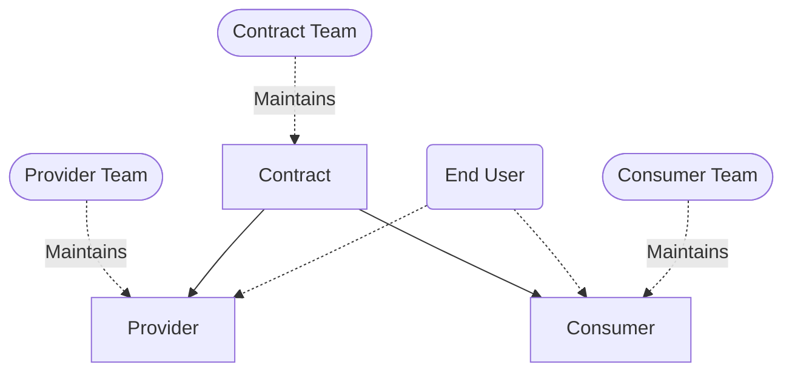

# Summary
[summary]: #summary

In Nixpkgs, modules duplicate a lot of code to setup their dependencies.
We introduce a pattern that allows to move
this custom code out of the modules and make it shareable
in an incremental, backwards compatible, extensible and testable way.

# Motivation
[motivation]: #motivation

As a motivating example, let's take a module
that sets up a service that needs a database
and this database can be PostgreSQL or MySQL.
Letting the user choose which database they want
is a great feature to have for a module but it is
a lot of code and must be thought out
thoroughly to get it right and to test correctly.

Having this code live in each module separately
is a waste for the whole community.
We see at least those disadvantages:

- It's more code to review and maintain for everybody.
- More burden on maintainers of a module implementing this feature:
  they must know how to setup their dependencies at a low-level
  and must keep the code up to date.
- Leads to difference in interface:
  options to setup a same dependency are different across modules.
- Leads to difference in implementation:
  every maintainer has their own style and knowledge,
  leading to not every implementation being of the same quality
  and being tested equally.
- Leads to difference in features:
  some implementations are more featureful than others,
  very few modules allow you to choose from multiple dependencies (e.g. PostgreSQL, MySQL or other).
- Not extendable without changing the source code:
  a user cannot easily choose to use a dependency the maintainer didn't add code for.

What we propose answers to all those issues
as well as allows a few things that's not possible currently:

- interfacing with dependencies and services outside of NixOS,
- using stubs in NixOS tests.

# Detailed design
[design]: #detailed-design

The core idea is to decouple the usage of a feature and its implementation.

Let's first introduce some nomenclature:
- _consumer_: The module using or needing a feature.
  Example: Nextcloud, Vaultwarden and others consume a database.
- _provider_: The module implementing a feature.
  Example: PostgreSQL, MySQL or SQlite provide a database.
- _inputs_: The set of options the consumer uses to communicate with the provider.
- _outputs_: The set of options the provider uses to communicate back to the consumer.
- _contract_: The concept sitting in-between a consumer and provider
  and making them agree on the `inputs` and `output`.

The _contract_ is a submodule with imposed options
associated with a behavior which every _provider_ must respect
and which is enforced through generic NixOS tests.
A _consumer_ and _provider_ fit then together thanks to structural typing
thanks to the contract enforcing the same `inputs` and `outputs` on both sides.

Structural typing was chosen because it fits nicely with
the existing module system. This follows the self-imposed constraint
of being as much backwards compatible as possible.
Indeed, this design can be added to existing modules incrementally
and in a backwards compatible way
by adding a new option with the contract name
which will translate options from the contract
to options already defined by the existing module.

Identified possible contracts are:
- File backup
- Streaming backup (for databases)
- Secrets (out of store values) provisioning
- SSL certificate generation
- Database setup (ensuring a database and user exist)
- Reverse proxy setup
- Reverse proxy "chain" allowing transparent traffic inspection
- LDAP user and group management
- OIDC provider integration
- Forward auth setup
- Any implicit convention in nixpkgs can be encoded this way

This RFC's goal is _not_ to define all those contracts
nor to identify the exhaustive list of existing contracts.
It's goal is to define a pattern, taking as example a few diverse examples.

These contracts will live under a new option path `contracts`
like `contracts.fileBackup` and `contracts.streamingBackup`.

See [prior-art][] for some useful comparisons that can help you get a better picture.

# Implementation
[implementation]: #implementation

The implementation has been worked out initially in the [SelfHostBlocks][] repo and perfected in the [module interfaces][] repo.
There are some slight variations proposed in this RFC compared to the module interfaces repo to get it out sooner rather than later. See the [corresponding unresolved section][unresolved-duallink] section.

It is important to keep in mind the following implementation comes from
seeing this pattern emerge "in the wild". The implementation came naturally
out of trying to increase code reuse. This somewhat legitimizes the implementation.

[SelfHostBlocks]: https://github.com/ibizaman/selfhostblocks/tree/main/modules/contracts
[module interfaces]: https://github.com/fricklerhandwerk/module-interfaces

## Actors
[actors]: #actors

Before looking at the code, it is useful to get a mental model of the actors involved.
There are up to 4 different individuals or teams involved for one contract:



1. `contract team`: The team maintaining a contract.
2. `provider team`: The team maintaining one module provider of that contract. Each provider of a same contract can have its own team.
3. `consumer team`: The team maintaining one module consumer of that contract. Each consumer of a same contract can have its own team.
4. `end user`: The end user linking one consumer of their choice with one provider of their choice for that contract.

Note that the contract is the central component here.
The provider and the consumer teams do not need to know what the other team is doing,
they can simply follow the contract and it will guarantee interoperability.

One nice property here is the `end user` can themselves add a new provider or consumer.

One more property is a module can consume or provide one or multiple times the same contract or different contracts.

## Data Flow
[dataflow]: #dataflow

Another consideration before looking at the code is how data flows through a contract.


1. A `consumer` sets the `input` option of the contract.
2. The `provider` reads from that `input` option.
3. The `provider` optionally accepts provider-specific options set by the `end user`.
4. The `provider` does some side effect (otherwise, there's no point).
5. The `provider` optionally writes to the `output` of the contract.
6. The `consumer` optionally reads from the `output` of the contract.

If you squint, this looks just like function application, only applied at the module level.

## Contract Interface
[Contract Interface]: #contract-interface

_The draft PR from which the following snippets are taken can be found [here][draftPR]._
_The intended reading order is first this document then going to the PR afterwards._

[draftPR]: https://github.com/NixOS/nixpkgs/pull/432529

Links to relevant commits:

- [contracts: init underlying module][]
- [contracts: add option to declare behavior tests][]
- [contracts: allow consumer to be unset][]

[contracts: init underlying module]: https://github.com/NixOS/nixpkgs/pull/432529/commits/bb561e9927ff73be12122644362ec3a1af61fd20 
[contracts: add option to declare behavior tests]: https://github.com/NixOS/nixpkgs/pull/432529/commits/75be2ddbc5b260a2a2e7f03c0103af803f54879b
[contracts: allow consumer to be unset]: https://github.com/NixOS/nixpkgs/pull/432529/commits/891ef82cf57bf31f7f4c02fae6d9739147af1753

We declare a new top-level option `contracts` of type `attrsOf (submodule ...)`.
Each contract will be a new value of this option.

With the `description` fields removed for brevity, the option is declared like so:

```nix
{ lib, ... }:
let
  inherit (lib) mkOption;
  inherit (lib.types) attrs attrsOf submodule listOf str deferredModule optionType;
in
{
  options.contracts = mkOption {
    type =
      attrsOf (
        submodule (interface: {
          options = {
            meta = mkOption {
              type = submodule {
                options = {
                  maintainers = mkOption {
                    type = listOf str;
                  };
                  description = mkOption {
                    type = str;
                  };
                };
              };
            };
            input = mkOption {
              type = deferredModule;
            };
            output = mkOption {
              type = deferredModule;
            };
            consumer = mkOption {
              type = optionType;
              readOnly = true;
              default = submodule (consumer: {
                options = {
                  provider = mkOption {
                    type = interface.config.provider;
                  };
                  input = mkOption {
                    type = submodule interface.config.input;
                  };
                  output = mkOption {
                    type = submodule interface.config.output;
                    readOnly = true;
                    default = consumer.config.provider.output;
                  };
                };
              });
            };
            provider = mkOption {
              type = optionType;
              readOnly = true;
              default = submodule (provider: {
                options = {
                  consumer = mkOption {
                    type = lib.types.nullOr interface.config.consumer;
                    default = null;
                  };
                  input = mkOption {
                    type = lib.types.nullOr (submodule interface.config.input);
                    readOnly = true;
                    default = provider.config.consumer.input or null;
                  };
                  output = mkOption {
                    type = submodule interface.config.output;
                  };
                };
              });
            };
            behaviorTest = mkOption {
              type = attrs;
            };
          };
        })
      );
  };
}
```

Let's review this submodule option by option.

- `meta`: Standard option to add some meta information to a contract.

The following two options are only used when defining a new contract.

- `input`: Input options for the contract. The `deferredModule` allows for the options to be declared independently in each contract.
- `output`: Output options for the contract. Same remark about `deferredModule`.

Now that we have the options to declare the `input` and `output` of a contract,
we can declare matching `consumer` and `provider` options using dependent types.

- `consumer`: Submodule option with 3 nested options:
  - `provider`: The linked `provider` for this consumer.
    This has to be set by the `end user` as they choose which consumer and provider to link.
  - `input`: Option whose type comes from the top-level `input` `deferredModule`.
    This option is made writable because the `consumer` is expected to write to it.
  - `output`: Option whose type comes from the top-level `output` `deferredModule`.
    This option is made `readOnly` because the `consumer` should only read from it.
    Its default value comes from the linked `provider`'s `output`.

- `provider`: Submodule option with 3 nested options:
  - `consumer`: The linked `consumer` for this provider.
    This has to be set by the `end user` as they choose which consumer and provider to link.
    This option is made nullable because the end user is not required to always use a contract.
  - `input`: Option whose type comes from the top-level `input` `deferredModule`.
    This option is made `readOnly` because the `provider` should only read from it.
    Its default value comes from the linked `consumer`'s `input`.
  - `output`: Option whose type comes from the top-level `output` `deferredModule`.
    This option is made writable because the `provider` is expected to write to it.

- `behaviorTest`: A full NixOS VM test which enforces similar side effects
  for all providers of a given contract. The test is generic on the provider
  and each provider must instantiate this generic test to verify they do indeed
  implement a contract. It is used to enforce any behavior not captured by the types.

The `end user` would then combine a consumer and provider like so:

```nix
config = {
  services.nextcloud.fileBackup.provider = config.services.restic.backups.nextcloud.fileBackup;

  services.restic.backups.nextcloud = {
    fileBackup.consumer = config.services.nextcloud.fileBackup;

    // Provider-specific options.
    repository = "/var/lib/backups/nextcloud";
    passwordFile = toString (pkgs.writeText "password" "password");
    initialize = true;
  };
};
```

Notice the `end user` must link the consumer and provider both ways.
This is discussed in [the unresolved section][unresolved].

# Examples and Interactions
[examples-and-interactions]: #examples-and-interactions

In this section we will explain, for each contract implemented in the PR,
why they are useful and their interesting properties. For actual code,
instead of simply copying the code here, see the PR.

## File Backup Contract
[fileBackupContract]: #file-backup-contract

Links to relevant commits:

- [file backup contract: init][]
- [restic: implement file backup contract provider][]
- [restic: define file backup contract behavior test][]
- [nextcloud: use file backup contract][]

[file backup contract: init]: https://github.com/NixOS/nixpkgs/pull/432529/commits/a59b42345c64e5d9f793fad779dcfbc02d1918a0
[restic: implement file backup contract provider]: https://github.com/NixOS/nixpkgs/pull/432529/commits/762a7318e3cd47f02743b46227595acf250a3084
[restic: define file backup contract behavior test]: https://github.com/NixOS/nixpkgs/pull/432529/commits/ad5751c854c0effb2a4c5bfbb993288f755c659e
[nextcloud: use file backup contract]: https://github.com/NixOS/nixpkgs/pull/432529/commits/6b7a87adc0b6c3d476ca6caa5d9ce4f1846049c1

This contract is for modules that have files to be backed up.

Without this contract, a user wanting to backup a service
must know the layout of the service on the file system.
Usually there is a `dataDir` option or similar, so one
can suspect backing this up is enough. But maybe not?
There is no way to know apart from reading the upstream documentation.

But even then, one must remember to use the correct user
to run the backup. If not, the backup will fail on first run.
And more pernicious, some files should sometimes be excluded from the backup
and that's usually only found out by experience.

The contract allows the maintainer of the service to encode all this,
hiding this complexity from the end user.

Having a contract here means also we have a lot of freedom on the organization of the backups.
It becomes easy to backup multiple services to multiple locations with multiple different programs like shown in this pseudo-code snippet:

```nix
let
  resticConfig1 = {
    passphrase = // ...
    repositoryPath = "repo1";
  };
  resticConfig2 = {
    passphrase = // ...
    repositoryPath = "s3://repo2";
  };
  borgbackupConfig1 = {
    // ...
  };
  borgbackupConfig2 = {
    // ...
  };
in
  {
    services.nextcloud.enable = true;
    services.vaultwarden.enable = true;

    restic.backups."nextcloud-repo1" = resticConfig1 // {
      backupFile = services.nextcloud.backupFile
    };
    restic.backups."nextcloud-repo2" = resticConfig2 // {
      backupFile = services.nextcloud.backupFile
    };
    restic.backups."vaultwarden-repo1" = resticConfig1 // {
      backupFile = services.vaultwarden.backupFile
    };
    restic.backups."vaultwarden-repo2" = resticConfig2 // {
      backupFile = services.vaultwarden.backupFile
    };

    borgBackups.backups."nextcloud-repo1" = resticConfig1 // {
      backupFile = services.nextcloud.backupFile
    };
    borgBackups.backups."nextcloud-repo2" = resticConfig2 // {
      backupFile = services.nextcloud.backupFile
    };
    borgBackups.backups."vaultwarden-repo1" = resticConfig1 // {
      backupFile = services.vaultwarden.backupFile
    };
    borgBackups.backups."vaultwarden-repo2" = resticConfig2 // {
      backupFile = services.vaultwarden.backupFile
    };
  }
```

This user-defined matrix of combination is not possible now.
It would require at least some heavy work
by the maintainers of Nextcloud and Vaultwarden.

The behavior test creates some files somewhere, backs them up, deletes them, restores them
and finally verifies the files are correctly restored.
To do this generically, we need a way to start the backup
and to restore from a backup which is standard across all providers.
This is where the idea for the `output.backupService` and `output.restoreScript` comes from.

Although the `consumer` does not care about those two options
they can be useful to the `end user`.
They also allow to create automated backups on deploys
and restoration from backups on rollbacks too.

## Streaming Backup Contract
[streamingBackupContract]: #streaming-backup-contract

Links to relevant commits:

- [streaming backup contract: init][]
- [restic: implement streaming backup contract provider][]
- [postgresql: implement streaming backup contract consumer][]
- [restic: define streaming backup contract behavior test][]

[streaming backup contract: init]: https://github.com/NixOS/nixpkgs/pull/432529/commits/700919f0c121ef500b3ec31d5126bd677434c19d
[restic: implement streaming backup contract provider]: https://github.com/NixOS/nixpkgs/pull/432529/commits/1d92450136106c25f1affb70817cef4bdae00c83
[postgresql: implement streaming backup contract consumer]: https://github.com/NixOS/nixpkgs/pull/432529/commits/2e02b68087fa36f274695911789db2d10579cc3c
[restic: define streaming backup contract behavior test]: https://github.com/NixOS/nixpkgs/pull/432529/commits/d360b941b45e5bacf0eb5b8a58825e7a51e53d4f

For databases and possibly other use cases,
there are no files laying around that can be backed up.
Instead, the backup can be read from a stream, usually on stdout of some program.

Creating files from those streams would allow to use the `fileBackup` contract directly
but it would be incredibly wasteful in resources, if even possible.
This is why another contract has been created which require a different backup tactic and thus different `input` and `output` options.

Like for the `fileBackup` contract, the test backs up a stream,
deletes the original resource and restores it, making sure it is correctly restored.
Here though, instead of engineering a stub for a stream, we directly use
the new `streamingBackup consumer` added to `services.postgresql`.

## Secrets Contract
[secretsContract]: #secrets-contract

Links to relevant commits:

- [secret contract: init][]
- [secret contract: declare behavior test][]

[secret contract: init]: https://github.com/NixOS/nixpkgs/pull/432529/commits/1bedf2dcf0960a4f33b7b7394aad51c4a3e436ae
[secret contract: declare behavior test]: https://github.com/NixOS/nixpkgs/pull/432529/commits/a14ec6ee6cb2205d7125dfa38f305838f8ce11ac

To pass credentials to a target host we deploy to,
the most common (as far as the author of this RCF knows) way to do this
is to encrypt the secret (possibly in the nix store)
and on activation decrypt it in an agreed upon location on the file system.

Currently in nixpkgs, most of the modules that require one or more secrets
define a global option that accepts a file containing all the secrets
in a given format. Usually the module uses under the hood
the `systemd.services.<name>.serviceConfig.EnvironmentFile` option
and the format is [dotenv][]. Failure to provide the file in the correct format
will result in an error at deploy time.

[dotenv]: https://www.dotenv.org/docs/security/env.html

Some services go the extra mile and provide one option per secret
and accept a path to a file that contains the raw secret like [kadmin][]'s
`adminPasswordFile` option. They implement some machinery to transform this file
in the expected format by the upstream service.
This moves the possible failure at evaluation time which is a very nice property.

[kadmin]: https://github.com/NixOS/nixpkgs/blob/nixos-25.05/nixos/modules/services/security/kanidm.nix

_Aside: This is such big step forward in user experience that we would like_
_to see this more available. This will be tackled though in the [vars][] proposal_
_and **not** in this RFC. The `vars` proposal will use the secrets contract_
_as presented here or a slightly modified if deemed necessary._

[vars]: https://discourse.nixos.org/t/vars-a-framework-for-managing-secrets-and-computed-values/62411

One problem encountered by those modules providing one option per secret
is the file must be readable by the user of the service.
This is often solved by relying on [systemd's credentials][] system
or less securely by using the `root` user in the service startup to read from the file.

[systemd's credentials]: https://systemd.io/CREDENTIALS/

This contract provides an alternative where the `consumer` of the contract - the module requiring a secret - imposes a `user` to the secret `provider`, which here would be [agenix][] or [sops-nix][] for example.

[agenix]: https://github.com/ryantm/agenix
[sops-nix]: https://github.com/Mic92/sops-nix

Contrary to the previous contracts we covered, the `consumer` here needs to read the `output` of the `provider`
because it contains the path to the file containing the secret.

When testing a module that expects a file containing a raw secret,
the ubiquitous method to provide the file is using `pkgs.writeText`.
This works but has the issue the created file is world readable
and we thus do not test the file is accessible with the correct user.
To avoid this pitfall going forwards, we created the [`testing.hardcodedSecret`
`provider`][hardcodedSecret: new secret contract consumer]
which is an improved version of `pkgs.writeText`
where the resulting file is created with the requested `owner`, `mode`, etc.
as described by the contract `consumer`.

[hardcodedSecret: new secret contract consumer]: https://github.com/NixOS/nixpkgs/pull/432529/commits/6fbd099aa306d2cce337b8fa7ed7e0c8a255aebf

This new provider has been tested using the [contract's behavior test][hardcodedSecret: define behavior test for secret contract]
and has been used in [`services.stash`'s module][stash: use secret contract for passwords] as an example.

[hardcodedSecret: define behavior test for secret contract]: https://github.com/NixOS/nixpkgs/pull/432529/commits/448410a520225bc71e1616611cef7ad086c64cd1
[stash: use secret contract for passwords]: https://github.com/NixOS/nixpkgs/pull/432529/commits/19419ad95913fbed4636d0b24d95c80517c18340

# Drawbacks
[drawbacks]: #drawbacks

We are not aware of any because this solution is fully backwards compatible,
incremental and has a lot advantages. It also arose from a real practical need.

Care should be taken to not abuse this pattern though. It should be reserved
for contracts where abstracting away a `consumer` and `provider` makes sense.
We didn't find a general rule for that but a good indication that the pattern gets abused
is if we only find one `consumer` and `provider` pair in the whole of nixpkgs.

# Alternatives
[alternatives]: #alternatives

This design arose from trying to maximize code reuse.
We started by fiddling with nix code and the implementation came up naturally.

We are not aware of any alternatives to do this,
mostly because our attempts to tweak the code often led us often to infinite recursion or other module issues
so we couldn't stray too far from the way it is written now.

# Prior art
[prior-art]: #prior-art

We did not find any discussion about any of this by the nix community.
It is a bit self-centered but the two talks I (ibizaman) gave on this subject in nixpkgs can be considered prior art.
Note the syntax presented is a bit outdated now but the message is still relevant:

- 04/2024: Scale21x in Pasadena: [Easier NixOS self-hosting with module contracts](https://www.youtube.com/watch?v=lw7PgphB9qM)
- 11/2024 at NixCon2024 in Berlin: [Enabling incremental adoption of NixOS with module contracts](https://www.youtube.com/watch?v=CP0hR6w1csc)

A pre-RFC has been opened [on discourse][prerfc].

[prerfc]: https://discourse.nixos.org/t/pre-rfc-decouple-services-using-structured-typing/58257

A few useful comparisons outside of nixpkgs are:

- Contracts are closely related to Golang interfaces with options being methods and input and output options the inputs and outputs of the methods.
  The important bit is that in Golang, the saying goes "the bigger the interface, the weaker the abstraction".
  We should strive to keep the number of options to a minimum to make the contracts more general.
- Contracts are reminiscent of the [reverse dependency principle](https://en.wikipedia.org/wiki/Dependency_inversion_principle) which is used in a lot of places.

# Unresolved questions
[unresolved]: #unresolved-questions

## Dual Link
[unresolved-duallink]: #unresolved-questions-duallink

The current implementation requires the `end user` to link the consumer and provider
in both directions:

```nix
config = {
  # consumer to provider
  services.nextcloud.fileBackup.provider = config.services.restic.backups.nextcloud.fileBackup;

  # provider to consumer
  services.restic.backups.nextcloud.fileBackup.consumer = config.services.nextcloud.fileBackup;
};
```

It would be so much nicer if we could somehow require only to give the `consumer` to the `provider`
and it managed to make the link backwards automatically.
In the snippet above, this means removing the need for the `provider to consumer` line.

The issue comes from the `consumer` and `provider` option in the top-level `contracts` definition to be of type `optionType`.
They don't have access to the actual `input` and `output` values of an instantiated contract.

Experimenting on this has been done in the [module interfaces][] repo.
There, we set the `provider` option as a function which takes an argument
which is the instantiated `consumer`, so it is not of type `optionType` but of type `submodule` and has access to the real input and output values.
Unfortunately, this has two downsides:

1. It requires one more line in each provider definition. This would be okay if there wasn't the following downside.
2. There's no way to write side effects. This means the `provider` can only write to its own `output`, which misses the whole point of having contracts in the first place.

There's maybe a way to solve this but we didn't figure it out. Help is appreciated!
Beware though you will be crossing the edge of the module system and entering the land of infinite recursion.

## Documentation
[unresolved-documentation]: #unresolved-questions-documentation

It is not possible to build the manual right now. Doing so results in an error.

```bash
$ (cd nixos/; nix-build release.nix -A manual.x86_64-linux)

[...]

       error: attribute 'contracts' missing
       at /home/timi/Projects/nixpkgs/nixos/modules/services/web-apps/stash.nix:435:16:
          434|       jwtSecretKeyFile = mkOption {
          435|         type = config.contracts.secret.consumer;
             |                ^
          436|         description = "Path to file containing a secret used to sign JWT tokens.";
```

Comments in the [draft PR][draftPR] have been added to indicate what has been tried.
Any help is appreciated to solve this.

# Future work
[future]: #future-work

- Solve the [documentation][unresolved-documentation] issue.
- Identify contracts and their inputs, outputs and behavior tests.
- Identify services that would benefit from being consumers and providers of contracts and add the necessary options.
- Optionally solve the [dual-link][unresolved-duallink] issue.
