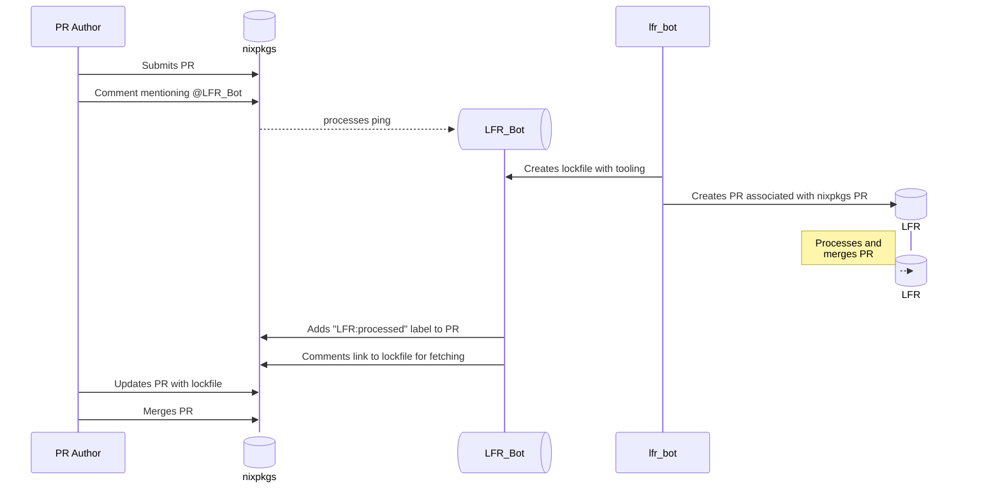

# Summary

[summary]: #summary

When adding packages to nixpkgs, or migrating them within nixpkgs, some packages do not contain lockfiles
that would allow us to lock their dependencies correctly. This is an issue with packages based on the
NPM, Yarn, PNPM, and Cargo package managers, but is not limited to them. Therefore, we should support
some mechanism for creating these sorts of lockfiles, **without** bloating the nixpkgs tarball with
megabytes of lockfiles that are only useful for a handful of packages.

# Motivation

[motivation]: #motivation

I have been migrating many packages from the deprecated `nodePackages` package set, into the main nixpkgs
package set(under `pkgs/by-name`). Many packages, such as [alex](https://github.com/get-alex/alex),
most(or all) packages by [`sindresorhus`](https://github.com/sindresorhus), and even projects using
Cargo and Rust such as [`proxmox-backup-client`](https://git.proxmox.com/?p=proxmox-backup.git;a=tree) do not have lockfiles.
This becomes an issue. Currently, the solution is to generate these lockfiles, and then vendor them within nixpkgs,
then using the `postPatch` phase(mostly) to copy this lockfile to the source tree, allowing for package
reproducibility.

The issue, of course, is that this massively increases the size of the nixpkgs tarball. nixpkgs issues such as
[#327064](https://github.com/NixOS/nixpkgs/issues/327064) and [#327063](https://github.com/NixOS/nixpkgs/issues/327063) have found
the effects of this are staggering, with nearly 6MiB of size(at the time) added to the nixpkgs tarball,
and this also contributed a lot of eval time of nixpkgs(See [this comment](https://github.com/NixOS/nixpkgs/issues/320528#issuecomment-2227185095)).

However, I believe there are solutions to this problem. The
[`rustPlatform.fetchCargoVendor`](https://nixos.org/manual/nixpkgs/stable/#vendoring-of-dependencies)
function allows for using upstream Cargo.lock files without parsing them within
nixpkgs, thus solving the previous problem of parsing these lockfiles within
nixpkgs itself, removing much of the eval time penalty. This does not solve the
issue for packages that do not ship their own lockfiles, however, which still
requires vendoring the lockfile within nixpkgs, which contributes to the above
evaluation time and tarball size issues.

Note also that the following design DOES NOT rely on [`import-from-derivation`](https://nix.dev/manual/nix/latest/language/import-from-derivation.html), as far as I know. This is a critical point for anything in
nixpkgs, as we should not require IFD to evaluate nixpkgs or build any packages.

# Detailed design

[design]: #detailed-design

I propose that a new repo, named `NixOS/lockfile-storage`(or something similar)
be created in the NixOS repo, along with a GitHub App for this purpose. This app
would help streamline the process of generating these lockfiles.

Note, for the rest of this document, I will refer to the above repository as "LFR", for "Lockfile Repository",
and the GitHub app/bot that manage it as the "LFR Bot".

## Workflow
The following diagram illustrates an idealized workflow using this new process.

Note also that I've designed this to be as simple from an end-user(PR Author)'s perspective. The
only additional friction they should have from this process is potentially waiting for someone to
approve an LFR PR, so that the lockfile will be accessible.

Caveats: We assume that the PR Author is also a committer, and we also skip over a potential approval
step for PRs in the lockfile repo in order to keep the repo safe over time.

Notes: `lfr` is Lockfile Repo, and `lfr_bot` is the mentioned GitHub App that would do this
automatically.



## Lockfile Repo Bot

For ease of contribution and extensibility, this bot should be written in Python, a la [nixpkgs-merge-bot](https://github.com/NixOS/nixpkgs-merge-bot).

When a user submits a PR, they should be able to immediately ping the bot to start the process of creating the lockfile.
This may involve an approval step, if users are not committers or maintainers, but otherwise should execute automatically.

The bot would be a simple Python script that recieves two things: A source URL, and a package manager type.
The source URL would be the `git clone`-able URL for a git repo, which is the only currently envisioned
source type, but again this could be designed to be easily extensible. The package manager type would be
one of a set of strings, such as "npm", "yarn", "yarn_berry", "cargo", or other similar phrase. This
would act as the two inputs to the script, where it would first clone the repository, then execute the
package manager's command to create a lockfile without actually installing dependencies, such as:

* npm: `npm install --package-lock-only`
* yarn berry: `yarn install --mode=update-lockfile`
* cargo: `cargo generate-lockfile`
* etc...

This allows us to follow a similar pattern to tools such as [Renovate](https://www.mend.io/renovate/) or [Dependabot](https://github.com/dependabot),
which can update lockfiles but do not need to install all dependencies to do so, which allows them to scale better.
Further, not installing code allows us to avoid many security issues that come from downloading and running untrusted code.

## Lockfile Repo

This would be a very simple repo. A package for lockfiles from each ecosystem, and then a folder per-package that uses that package manager. That way, there are not errors at the top level with "too many files", and so that if you know where a package is, you can find it easily.

Further, updates to a package should automatically update the lockfile, and replace it in the
lockfile repo, NOT adding an additional file to the repo. This is to prevent unbounded growth of the
repo, and to try and keep it reasonable to clone if needed(though again, the workflow is designed to
hopefully not need that). Finally, when dropping a package, this should be able to be automatically
detected and a PR removing it from the LFR should be automatically generated. Old lockfiles,
however, would still be accessible since they are stored in the data of previous commits.


# Examples and Interactions

[examples-and-interactions]: #examples-and-interactions

From a user perspective, I want this to be as smooth as possible. So, after submitting a PR, you would add a comment with the following structure:

```
@NixOS/LFR_Bot [repo] [type]
```

For example:

```
@NixOS/LFR_Bot https://github.com/NixOS/nixpkgs npm
```

which would `git clone` the nixpkgs repo and attempt to create an npm `package-lock.json` file.

These commands should be sanitized so that only the original author of the PR or committers can run
this process, avoiding some potential issues. Further, non-maintainers must wait for an approval
step on the workflow, possibly with a committer having to comment `@NixOS/LFR_Bot approve` or some
similar message.

# Drawbacks

[drawbacks]: #drawbacks

If the lockfile storage repository is deleted or purged in any way, then anything relying on this
repository is broken, unless the lockfile has already been fetched locally and stored as a FOD. We
could approach this problem by having some special fetcher that can use alternative sources, such as
a CDN or other server(for users in China who may have issues accessing GitHub, for instance).

Further, this is another potential way for someone to sneak untrusted code into nixpkgs, but:

* The lockfiles are generated on nixpkgs-related infrastructure(either self-hosted or GHA), so
there is not a risk of attackers patching lockfiles for malicious purposes.
* Non-maintainers should go through an initial approval before having this run for their PRs.
* The lockfiles should also only be generated for supported ecosystems, and if lockfiles already exist,
they should be used instead of relying on this tool.

# Alternatives

[alternatives]: #alternatives

* Not packaging packages with missing lockfiles
  * A very valid idea! However, there are enough of these sorts of packages, and lockfiles are already such an issue
  for nixpkgs, that we should solve this so that we can move more lockfiles out of tree.
* Storing lockfiles in-tree
  * See above issues r.e massively increased tarball size. I aim to prevent that with this, so doing that
  would be antithetical to this.

# Prior art

[prior-art]: #prior-art

Currently, we store lockfiles in-tree. This is bad, for all the reasons mentioned above, and so that is the only prior art I've considered while writing this.

However, you could consider projects like `node2nix`, `cargo2nix`, and others, prior art for this,
but that involves translating the lockfile and storing that representation in the nixpkgs repo,
which still contributes to the size issue mentioned. Further, this also has a larger impact on
evaluation time, as some of these fetchers have each dependency as their own separate derivations,
which means a lot of derivations could be instantiated and fetched, which does pose an
outsized(though relatively minor) disk size impact due to the ratio of metadata to derivation size.

# Unresolved questions

[unresolved]: #unresolved-questions

Lots of it! I don't know any particular questions that remain unanswered at the moment, but I would be glad to answer those if they come up.

# Future work

[future]: #future-work

This may create additional maintenance burdens in the future, with an additional repo being part of the nixpkgs process in some cases, but I have tried to design this with an eye for maintainability over time.
